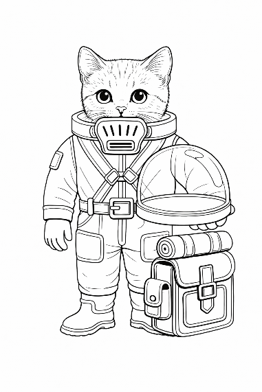

# Rollenspiel - eine gemeinsame Geschichte

Ein Rollenspiel ist wie eine gemeinsame Geschichte. Die erzählt ihr gemeinsam.

**Einer (der Meister)** kennt die **ganze Geschichte**. Er erzählt den anderen Spielern

* wo sie sich befinden
* wen oder welche Tiere sie treffen und
* welche Auswirkungen ihre Handlungen haben

Die anderen sind **die Spieler* und erzählen mit und sprechen und handeln.

## Benötigte Materialien

Das braucht ihr zum Spielen

* Charakterbogen – für jeden Spieler einen
* Stifte
* zwei sechsseitige Würfel (W6). (Im Regelbuch steht 1W6 für einen sechsseitigen Würfel, 2W6 für zwei Würfel und ½W6 für einen „halben“ Würfel. Keine Sorge: Du musst den Würfel nicht zersägen. Stattdessen wird der erwürfelte Wert halbiert und anschliessend auf- oder abgerundet.)
* ein Abenteuer / Geschichte – für den Meister

## So spielt ihr ! - als „Meister“

Es gibt bei diesem Spiel einen besonderen Teilnehmer: den „Meister“.

Als Meister beschreibst du die Welt. Du kennst die Geschichte und bist der **Haupterzähler**. Du nimmst die Spieler an die Hand und führst sie durch die Geschichte. Du beschreibst jeden Raum, jede Umgebung, jede Person, die in der Geschichte vorkommt.

Du **hilfst** den Spielern, wenn sie nicht weiterwissen. Du ermöglichst den Spielern ein **faires Spiel**, **Spannung** und vor allem **viel Spass**.

(Der Meister kennt in der Regel die **Würfel-Regeln** und trägt die **grösste Verantwortung**. Als Meister hast du die Möglichkeit, moralische Konflikte aufzubauen, sodass nicht nur der Charakter wächst. Auch der Spieler dahinter wird an diesen Herausforderungen massiv wachsen.)

## So spielt ihr ! - als „Spieler“

Und du beschreibst, was dein Charakter macht. Dein Charakter? Wer bist du überhaupt?

Du bist ein Marser – ein felines (ein katzenhaftes) Wesen. Du lebst in deiner Wohnbleibe. Und immer wenn du rausgehst, hast du einen Anzug an. Denn draussen ist es giftig: Überall ist Brom. Halte also deinen Anzug immer schön in Ordnung.

Du siehst also so aus, wie das Bild hier zeigt. Drucke das Bild hier gerne aus und male das Bild gerne bunt an! Dafür ist es da ;-)
