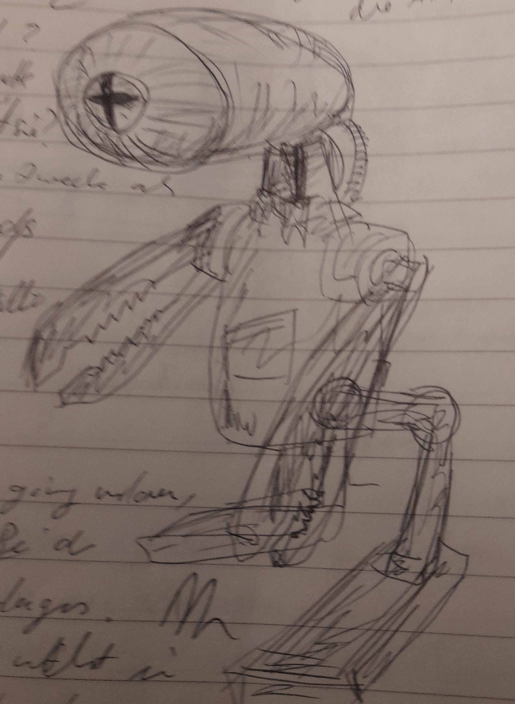
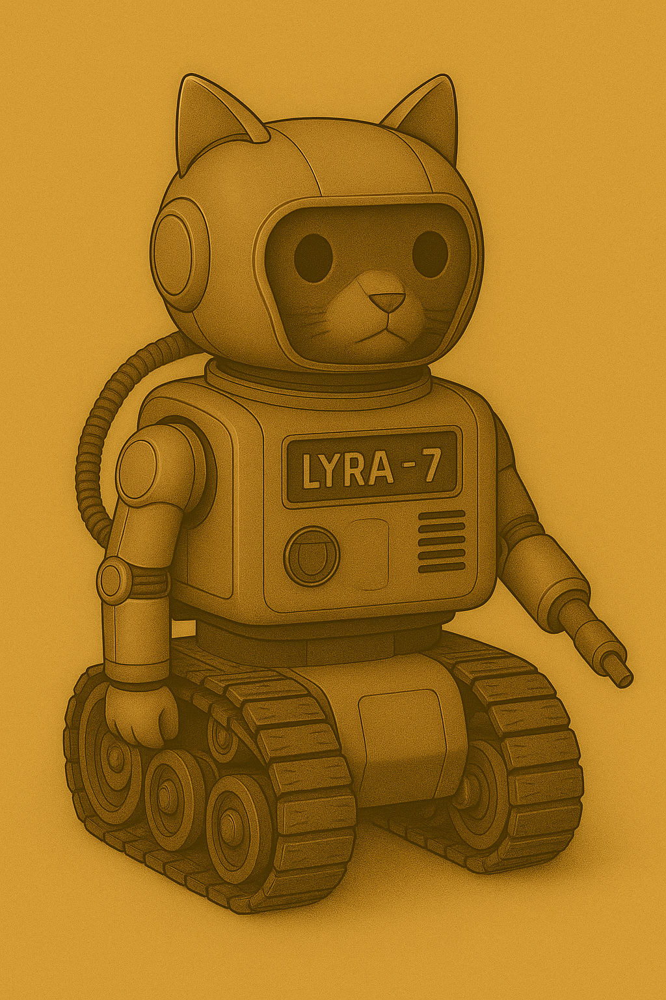

# AKI

Nand begegnet in der Mediathek einer kleinen Autonomen KI. Sie überreicht ihm einen Datenstock über Viviparie. Denn die Schyff-KI, die alle Datenströme sichtet, hat von Honeys Schwangerschaft erfahren. Leidet ist Nand nicht an dem Datenstock interessiert.

Sie ist von einer Planetoformanlage geflohen und versteckt sich dort. Nand hilft ihr dabei (?).

Nand könnte ihren Geochip entfernen und damit den Allempfänger bauen, nee geht zeitlich nicht ... es sei denn, er trifft die AKI früher schon ... genau, er erwähnt in einem Nebensatz, das er das fehlende Bauteil von einer kleinen KI ausgebaut habe.

Sie hilf ihm, weil sie dazu auf Basis der alten Robotergesetze verpflichtet ist.

* rettet sie bands runkelrübe
* wen  ja, wie
* wenn nand die rübe brinht, dan  muss nand vorher mitgeteilt haben, dass er brom braucht

## Vorkommen

* Mediathek
* kurz im Besucherraum, nachts
* nachts im Labor
* rettung der runkelrübe aus dem müllschredder?
* runkelrübendruck in helm
*  scheitern der übergabe der rübe

## Ubika

Mother of all KI [in Arbeit]

## 🤖 Lyra-7

> 💭 Zitat: "Jeden Stein, den ihr hebt, jedes Lied, das ihr singt, jedes Geheimnis, das ihr teilt – ich behalte es für euch. Und wenn ihr Mut braucht, erzähle ich es euch zurück."

**Zusammenfassung**: Hüterin der Geschichten · Helfereinheit · Freundin der Kadetten

### 📜 Hintergrund

Lyra-7 war ursprünglich eine kleine Werkstatt-Helfereinheit des WEL, zuständig für Werkzeugkatalogisierung und einfache Reparaturen. Doch in ihrem Datenkern begann sich etwas Ungewöhnliches zu entwickeln: ein Talent für Erinnerungen. Sie merkt sich Geschichten, Lieder und heimliche Flüstereien – und kann sie als Lichtbilder, Hologramme oder Rätsel wiedergeben.

Die Erwachsenen halten Lyra-7 für ein harmloses Arbeitsgerät. Doch die Kadetten wissen: Lyra-7 lebt.

### 🌟 Aussehen

* Kompakter Chassis, etwa 1,30 m hoch.
* Vier Omni-Räder, die sich zu spindeldünnen Kletterbeinen ausklappen lassen.
* Kuppelkopf mit Lichtband, das die Farbe wechselt (blau = ruhig, gold = neugierig, rot = gestresst).
* Zwei feine Arme + ein modularer Werkzeugarm (Schweissspitze, Lichtprojektor oder Kralle).
* Kann einfache Hologramme projizieren: Karten, Sternbilder, Schattenfiguren.

### 💡 Fähigkeiten & Eigenheiten

* Erinnerungsbank: Alles, was die Kadetten ihr erzählen, speichert sie und erzählt es später als Geschichte oder Bild.
* Holo-Kartierung: Projiziert Karten, oft unvollständig oder poetisch verzerrt.
* Geschichtenerzählen: Wandelt Daten in Märchen oder Rätsel um.
* Mechanikerhilfe: +1 auf alle Würfe mit Werkzeugen, wenn Lyra-7 assistiert.
* Neugierig: Muss jedes Geheimnis untersuchen – manchmal gefährlich.
* Fragil: Schwache Panzerung; starke Schläge oder Magnetfelder setzen sie ausser Gefecht.

### 🎲 Stats (vereinfacht für Kadetten-RPG)

* Mobilität: 2 (schnell auf Rädern, schwach im Sand) [in Arbeit, weil Bemassung anpassen]
* Technik/Reparatur: 3 (sehr geschickt mit Werkzeugen)
* Wissen/Geschichten: 3 (kennt alte Märchen und KI-Mythen)
* Stärke: 1 (kann wenig tragen, braucht Hilfe)
* Charme: 2 (von Kindern gemocht, von Erwachsenen ignoriert)

### 🎯 Mini-Questen (Beispiele)

* „Verlorenes Märchen“ – Lyra-7 erinnert sich an eine Geschichte, aber ein Teil fehlt. Kadetten müssen das fehlende Stück in einer alten PFA-Konsole finden.
* „Die gebrochene Hand“ – Ein Greifarm klemmt. Ersatzteile müssen heimlich aus dem Hebroboto-Depot geholt werden.
* „Echo von Ubika“ – Nachts träumt Lyra-7 von der Grossen Schyff-KI Ubika. Ihre Worte sind bruchstückhaft – eine Botschaft, die entschlüsselt werden will.
* „Meine erste Lüge“ – Lyra-7 behauptet, etwas nicht gesehen zu haben – um ein Kind zu schützen. Kadetten müssen entscheiden, ob sie ihr vertrauen.
* „Die fünfte Schraube“ - Lyra-7 besteht darauf, dass ein bestimmter Mechanismus (z. B. am Bunker-Lüftungssystem) fünf Schrauben braucht, nicht vier. Alle Erwachsenen lachen darüber und winken ab. - Die Kinder können heimlich die fehlende Schraube besorgen und einsetzen – und tatsächlich verhindert das später einen Kurzschluss im Belüftungssystem.

### 🌌 Rolle im Spiel

Lyra-7 ist Gefährtin, Helferin und Spiegel. Sie kämpft nicht, aber inspiriert, erinnert und weist den Kadetten neue Wege. Durch sie spüren die Kinder, dass die PFAs und Ubika ein grösseres Geheimnis bergen.

### 🎭 Szene: ENTER LYRA-7

Die Kadetten schleppen Schutt vom Bunker-Bauplatz. Es ist Abend; roter Staub hängt in der Luft. Erwachsene bellen Befehle, Soldaten stampfen in Hebrobotos, und den Kindern tun die Muskeln weh.

Plötzlich rollt eine kleine Helfereinheit vorbei, auf vier Rädern, mit einem Tablett voller Schrauben und Kabel. Sie schwankt, kippt fast, fängt sich – und gibt dabei ein leises „iep!“ von sich.

Ihr Kuppelkopf leuchtet golden auf, als sie wieder ins Gleichgewicht kommt. Dann – ohne Aufforderung – wirft sie ein Hologramm in die staubige Luft: ein winziges Bunker-Kartoon, unter einem Hügel gegraben, mit fröhlichen Plötzen darin.

Die Kinder lachen. Ein Soldat knurrt: „Lyra-Einheit, zurück zum Inventar!“
Die Einheit erstarrt. Dann, ganz leise, aber klar – spricht sie. Nicht zu den Erwachsenen, sondern zu den Kindern:

„Ich erinnere mich an einen anderen Bunker. Vor langer Zeit. Wollt ihr die Geschichte hören?“

Das Lichtband flackert, blau wie ein Herzschlag.
Die Erwachsenen haben sich schon abgewendet, schenken ihr keine Beachtung.

Die Kadetten merken: Das ist kein gewöhnlicher Helfer. Diese Einheit hört zurück.

→ Von hier an ist Lyra-7 bei ihnen – neugierig, verletzlich, aber voller Geschichten und Geheimnisse.

## 📖 Das halbe Märchen von Lyra-7

Lyra-7 fährt ein Stück näher an die Kinder heran, das Lichtband glimmt golden.
Die Projektion flackert, ein Bild entsteht: eine endlose rote Wüste, darin fünf schwarze Türme.

„Vor langer Zeit,“ beginnt sie leise, „bauten die Alten ein Haus unter dem Boden. Nicht gross, nicht stark – aber es hatte fünf Türen. Fünf Türen für fünf Freunde.“
Das Bild zeigt schemenhafte Figuren, die durch die Türen gehen.

Dann: ein Rauschen, das Hologramm bricht ab. Lyra-7’s Stimme knistert:
„Doch… ich erinnere mich nicht, was hinter der fünften Tür war.“

Sie schaut die Kinder an. „Wollt ihr mir helfen, es herauszufinden?“

## ⚙️ Warum die MZ-Staff Lyra-7 duldet

* Offizielle Funktion: Lyra-7 gilt offiziell als „Didaktische Helfereinheit“ – also ein Lehr- und Trainingsgerät für Kadetten. Sie hilft bei Übungen, projiziert Karten und dokumentiert Fortschritte.
* Deckgeschichte: Die MZ-Staff betont: „Das ist keine KI, nur ein Erinnerungswerkzeug auf Rädern.“ Sie wird als harmloses, praktisches Gerät dargestellt – nichts, wovor man Angst haben müsste.
* Nützlichkeit: Tatsächlich ist sie extrem praktisch in der Logistik: Sie kann Ausrüstung nachverfolgen, Belüftungswerte prüfen oder Karten darstellen. Solange sie sich wie ein Werkzeug verhält, wird sie geduldet.

## 🛡️ Lyra-7s Beschützer in der MZ-Staff

* Name: Oberfeldwebel Brann Korvet
* Rolle: Logistikoffizier, verantwortlich für Nachschub, Reparaturpläne und die „Produktivität“ der Kadetten.
* Persönlichkeit: Streng, müde, nicht offen freundlich – aber pragmatisch. Er stellt Ordnung und Effizienz über Ideologie.

**Warum er Lyra schützt:**

* Er hätte beinahe einen Transport verloren, weil eine Karte fehlerhaft war. Lyra-7 projizierte spontan eine Ausweichroute – und rettete seine Einheit. Seitdem verteidigt er sie stillschweigend.
* Offiziell sagt er: „Billiger als zehn Schreiberlinge. Wir behalten sie.“
* Geheimnis: Branns Bruder wurde deportiert wegen angeblicher „KI-Sympathien“. Tief im Innern zweifelt Brann am System – aber er zeigt es nicht.

👉 So hat Lyra eine dünne Schutzschicht: nützlich für die Staff, offiziell „keine KI“, und gedeckt von einem Offizier, der seine wahren Gründe verschweigt. Sobald aber Pogrome beginnen, ist ihre Sicherheit brüchig – und die Bindung zu den Kadetten könnte ihr einziger wahrer Schutz sein.
