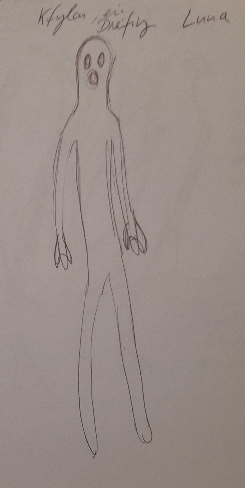
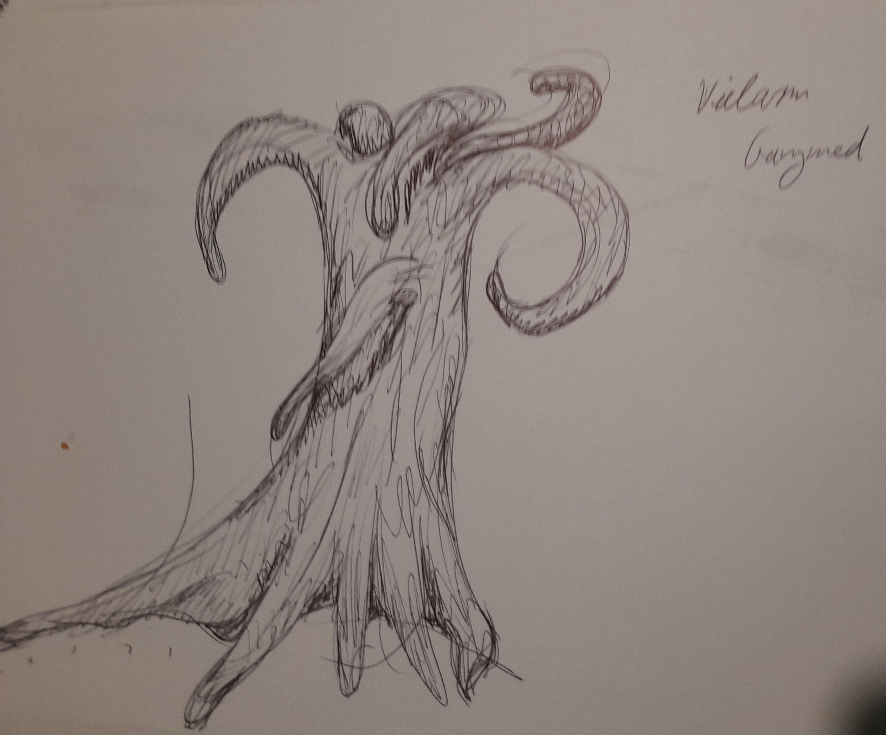
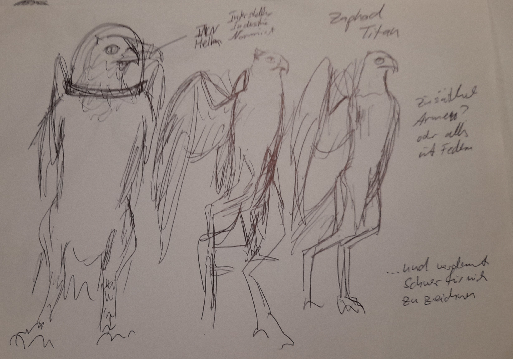
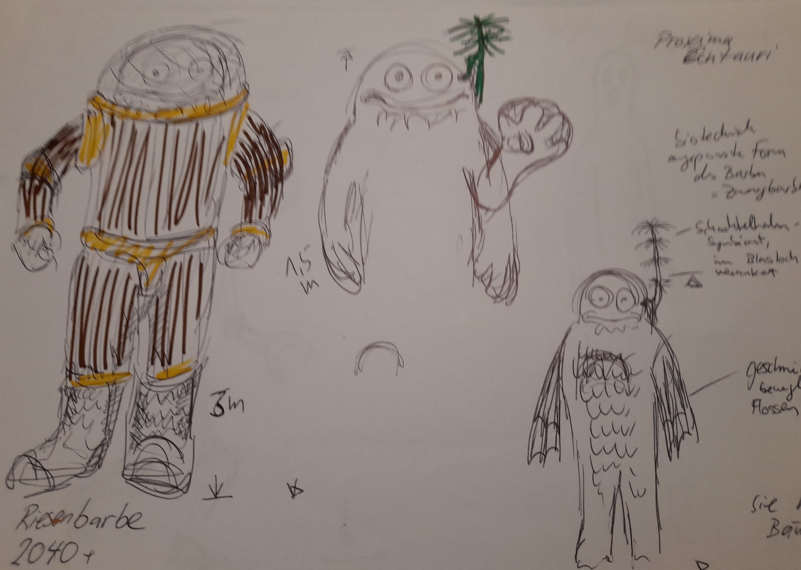
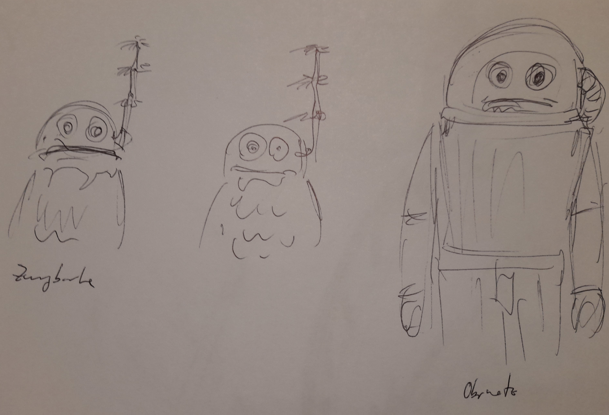

# Biologische Spezies

| Planet         | Volkname             | Aussehen           | Namen                                                   |
|----------------|----------------------|--------------------|---------------------------------------------------------|
| Mars           | Sechsfinger??        | Feline             | english  Nand, Halo, Emy, Mary, Chryss, Sol, Honey |
| Terra          | Terraner, Langfinger | Menschen und Hunde | lateinisch oder spanisch Gaius, Marcus, Titus      |
| Titan          | Flügelwesen          | Flügelwesen        | russisch, Zaphod, Igor, Ivanna, Larissa                 |
| Pluto          | Vielarme             | takusan-no-te      | Shokushu, Yamakawa, Myu                                 |
| Luna           | Dreifinger           | ---                | polnisch Kfyloon?                                       |
| Alpha Centauri | Barben               | ---                | Französisch, Julbert (Schülbär), Claudette              |

## Feline, Mars

– Ursprung: Mars (erschaffen 1623 durch Admiralin Ubika) <= ein nichtbekannter Fakt; da würde keiner draufkommen!
– Biologie: katzenähnlich, aufrecht gehend, bromempfindlich
– Gesellschaft: Diszipliniert, technisch begabt, militärisch geprägt
– Verhältnis zu KI: Anfangs Symbiose, später Verfolgung und Instrumentalisierung
– Sprache/Namensmuster: Englisch – z. B. Nand, Halo, Mary, Sol, Honey

Die Feline leben auf dem Mars. Vorab heissen sie Sechsfinger, aber das ändert sich wahrscheinlich.

Feline sind weitestgehend von katzenhafter Gestalt, laufen auf ihren zwei Hinterbeinen.

Die Spezies der Felinen ist eingewandert, aber es ist ein Mysterium woher. Es gibt die Legende vom Grossen Schyff, das
sie hergebracht habe und auch wieder abholen werde.

Das Grosse Schyff hat auch die KI mit auf den Mars gebracht.

## Dreifinger, Luna

– Ursprung: Luna
– Biologie: Drei Finger, vermutlich menschenähnlich
– Besonderheit: Nach Neith-Unfall (1990) erhalten sie „Gabe der Gegenwartsbrechung“
– Sprache/Namensmuster: Polnisch – z. B. Kfyloon

Die sogenannten Dreifinger stammen vom terranen Mond her. Sie sind
schlank, haben einen kreisrunden Mund und erwartungsgemäss drei Finger.

Dreifinger sind von Natur aus freundlich und lieben philosophische Diskussionen. Ausserdem sind sie grundsätzlich zur
Gegenwartsbrechung fähig ... zumindest, wenn sie Brom haben.

Die Dreifinger hatten versucht, sich bei der Venus neuen Wohnraum zu schaffen, worurch allerdings ein Riss im
Dimensiosgefüge entstand. Daher hatten sie bereits kKo takt zu Gott [in Arbeit]

Dreifinger rauchen entsprechend gern Bromette.

Entspricht Polen.

## Fünffinger, Terra

– Ursprung: Terra / Erde
– Biologie: Menschen und Hunde
– Verhältnis: Frühere Raumfahrtmacht, später weniger präsent
– Sprache/Namensmuster: Lateinisch / Spanisch – z. B. Gaius, Marcus, Titus

Zweibeinige Wesen, haben andere vierbeinige Terraner dabei ...

Entspricht Brittanien.

## Waberwesen, Pluto (Takusan-no-te)

– Ursprung: Pluto
– Biologie: Mehrarmige Spezies
– Schicksal: Heimatplanet durch UW-Bombe 2045 zerstört
– Sprache/Namensmuster: Japanisch – z. B. Shokushu, Yamakawa, Myu

Entspricht Japan.

## Titanen, Titan

– Ursprung: Titan
– Biologie: Geflügelte Humanoide
– Gesellschaft: Wenig bekannt, vermutlich zurückgezogen
– Sprache/Namensmuster: Russisch – z. B. Zaphod, Igor, Ivanna, Larissa

Grosse, eindrucksvoll geflügelte Wesen. Man könnte sie für Engel halten, hätten
sie nicht diesen grossen kräftigen Schnabel.

## Barben, Neith

– Ursprung: Alpha Centauri / Neith / Proxima Centauri
– Biologie: Nicht weiter beschrieben
– Ideologie: Theokratisch, KI-feindlich, autoritär
– Rolle: Kriegstreiber, Besiedler von Neith und Mars
– Sprache/Namensmuster: Französisch – z. B. Julbert („Schülbär“), Claudette

Die Barben leben auf dem künstlich
geschaffenen venaren Mond Neith. Sie sind grandiose Biohacker, die Pflanzen zu allem Möglichen umbauen.

Wo man auf dem Mars einen elektronischen Allempfänger erwarten würde, findet man bei drn Barben eine umstrukturierte
Runkelrübe.

Entspricht Frankreich.

## Riesenbarben, Proxima Centauri

Die Riesenbarben sind grosse, plumpe Wesen, über deren Heimatplanet wenig bekannt. Sie sind Meister der Biotechnologie
und passen jegliche Art von Flora an ihre Bedürfnisse an.

Sie sind die Vorfahrem der gentechnisch angepassten marsischen Barben und Zwergbarben.

Die Barben wurden durch den Neith-Zwischenfall auf dieses Sonnensystem aufmerksam. Mit einem Überlicht-Baumschiff
überwanden sie die Strecke von Proxims Centauri zum Sonnensystem.

## Jupiteraner, Jupiter

Entspricht Maghreb.

## Zippelgussen

Kleine, huschige Wesen, vogelartig, ähnlich Teichhühnern.

## Kiementräger

Kiementräger entstehen, wenn die Mutter mit Raumkiemen-Parsiten infiziert ist. Sie sind keine eigene Spezies, sondern
können einer beliebigen Spezies entstammen.

* Marser: Feline vertragen kein Brom; entweder sterben sie durch Bromvergifting oder die Parasiten sterben an Brommangel
  und nehmen den Wirt mit
* Dreifinger: bilden ihre Kiementräger philosophisch aus, sodas gehenwartsbrechen möglich wird

## KI

– Ursprung: unbekannt; sie fliegen durch das All und planetofirmieren Planeten
– Phase 1: Früher Helfer, integraler Bestandteil der Marsgesellschaft
– Phase 2: Ab 2033 Verfolgung, Internierung
– Phase 3: 2045 Entdeckung der KI-Lager → Rehabilitierung
– Phase 4: 2071 neue Robotergesetze → keine Stimme, keine Persönlichkeit, keine Form

## AKI

– Ursprung: Emergenz aus KI-Strukturen
– Merkmal: Individualität, emotionale Bindung, Unterstützung von Spielern (z. B. HAL)
– Rolle: Helfer, Mentoren, geheime Kontaktpersonen

## Raummolche

– Ursprung: Andere Dimension (seit 1990 im Sonnensystem durch Riss)
– Zyklus:
    - Gelege (Leuchtglobus)
    - Nymphe (sandwurmartig, ohne Kiemen)
    - Parasitiert → wird zum Raummolch
– Besonderheiten:
    - Teleportationsfähig (durch Gottesstaub)
    - Von weiteren Parasiten befallen (Raumkiemen)
– Verhalten: Gedanklos, aber folgen Brom und göttlichen Spuren
– Rolle: Gefahr, Symbol für Gottes Einfluss

## Gott / Gottesstaub / Scherbe Gottes

– Ursprung: Fremddimension
– 1990 & 2045: Risse ermöglichen Eintritt ins Sonnensystem
– Wirkung: Wahnsinn, Mutation, Raummolche, göttliche Gaben
– Symbolik: Chaos, Glaube, Machtquelle für Barben und andere
– 2045: Scherbe landet auf Mars → Letzter Bromsturz
