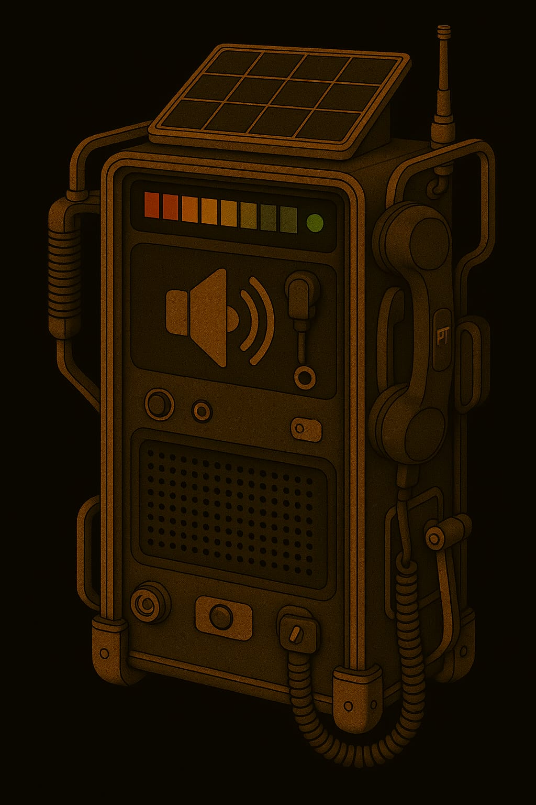
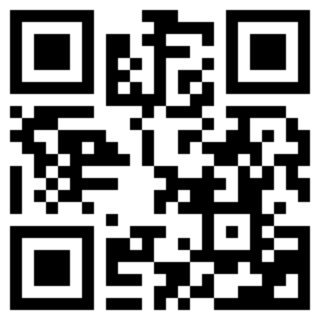
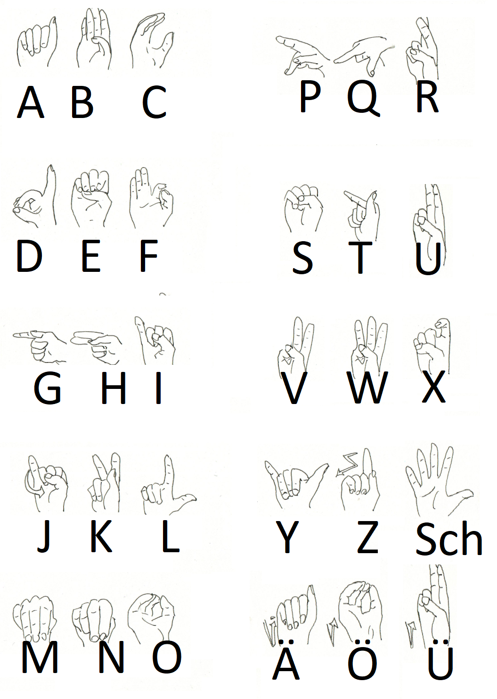

## Kommunikation

## 1. Gesprochene Sprache

Innerhalb von Gebäuden mit atembarer Atmosphäre braucht man keinen Helm oder Anzug.
Hier kann man ganz normal sprechen.

Ausser-Marser chaben gernä ainen AAkzent!

* **Titanen**: russischer Akzent, die Betonungen sind verschoben
    * jedes "ch" => "kch"
    * a => aaa
    * ch => chch
    * h => ch
    * gezogene Vokale an den falschen Stellen
    * falsches grammatisches Geschlecht
    * Merkspruch: ich wiinscht ichch chätte ein Pferdeekutsch
* **Barben**: französischer Akzent
    * jedes "ch" => "sch"
    * keine "h"
    * a => o
    * falsches grammatisches Geschlecht
    * Merkspruch: isch säe einö 'übschen Kühlschronk
* **Lunare**: knauffffeln
    * jedes "ch" => "f"
    * jedes "s" => "f"
    * jedes "sch" => "f"
    * jedes "z" => "tf"
    * Merkspruch: If se-e nift, waf tu meinft ... gib dof einfaf tfu, daff daf feiffe ift

## 2. Funkprotokolle, gesprochen

### Einleitung

Kommunikation zwischen zwei und mehr Teilnehmern auf ein- und demselben Kanal setzt Disziplin voraus.
Damit das klappt, gibt es das Funkprotokoll.

Generell gilt:

* erste denken, dann sprechen
* wer das Gespräch startet, der endet es auch

Hier Beispiele:

### Beispiele

Einfach

* Gruppe I von Basis – Kommen
* hier gruppe 1 – kommen
* hier basis - befehl: Suchaktion einstellen – kommen
* hier gruppe 1 - verstanden kommen
* hier basis - ende

#### Eingespielter Funkverkehr

* Gruppe 1 von Basis, bla bla bla kommen
* hier gruppe x verstanden, ende

#### Achtung Spruch

* gruppe x von basis achtung spruch kommen
* hier gruppe x achtung sprung kommen
* hier basis ort datum uhrzeit frage / Nachricht wiederholen / kommen
* hier gruppe x ort datum, uhrzeit [wiederholung der nachricht] kommen
* hier basis verstanden

#### Reihenruf

* gruppe x,y,z von basis laber rhabarber kommen
* hier gruppe x verstanden kommen
* hier gruppe y verstanden kommen
* hier gruppe z verstanden kommen
* hier basis ende

#### Sammelruf

* alle von basis laber rhabarber kommen
* hier gruppe x verstanden kommen
* hier gruppe y verstanden kommen
* hier gruppe z verstanden kommen
* hier basis ende

## 3. Gebärdensprache

Mit Helm draussen und ohne Mikrophon oder sonstiogen Funkverkehr kann man draussen sich nicht unterhalten.
Der Helm hält den Schall so gut ab; allenfalls kann man sich schreiend unterhalten. Und das ist auf Dauer zu
anstrengend.

Draussen unterhalten sich alle in Gebärdensprache. Das heisst:

* Für jedes Wort bzw. für jeden Begriff gibt es ein Zeichen
* Das Verb ist immer hinten, also ICH PFERD SEHEN
* Mund und Mimik sind daran beteiligt

Umsetzung am Rollenspiel-Tisch

* Du kannst  DGS (Deutsche Gebärdensprache) => suuper! Verwende die!
* Du kannst keine DGS => unterhaltet euch einfach normal am Rollenspiel-Tisch; denkt aber daran: ihr könnt euch **nur
  auf Sichtweite** unterhalten; man kann niemandem hinterherrufen oder von hinten ansprechen :-D

Info: Grossschreibung? Ein Gebärdenbegriff wird durch Grossschreibung markiert.

| [spreadthesign](https://spreadthesign.com)                                       | [signdict](https://signdict.org)                                       | [manimundo](https://manimundo.de)                                         |
|----------------------------------------------------------------------------------|------------------------------------------------------------------------|--------------------------------------------------------------------------|
|  |  |  |
| Lexikon                                                                          | Lexikon                                                                | Lernen                                                                   |

#### Finger-Alphabet

Neue Begriffe werden mit dem Fingeralphabet aufgegriffen. Und das findest du hier:

## Schrift: Runen

Hier das Runen-"Alphabet" beziehungsweise das sogenannte Futhark.
Alles wird in RUnen geschrieben.

Wenn deine Spieler Sppass am Dechifrieren haben => wirf ihnen einfach einen Runentext hin :-)
Oder einfache Beschriftungen.

| Rune | Name        | Lautwert |
|------|-------------|----------|
| ᚠ    | Fehu        | f        |
| ᚢ    | Ūruz        | u        |
| ᚦ    | Þurisaz     | th       |
| ᚨ    | Ansuz       | a        |
| ᚱ    | Raidō       | r        |
| ᚲ    | Kaunan      | k        |
| ᚷ    | Gebō        | g        |
| ᚹ    | Wunjō       | w        |
| ᚺ    | Hagalaz     | h        |
| ᚾ    | Naudiz      | n        |
| ᛁ    | Īsaz        | i        |
| ᛃ    | Jēra        | j        |
| ᛈ    | Perþo       | p        |
| ᛇ    | Eihwaz      | e        |
| ᛉ    | Algiz       | a        |
| ᛊ    | Sōwilō, Sól | s        |
| ᛏ    | Sōwil       | s        |
| ᛊ    | Tīwaz       | t        |
| ᛒ    | Berkanan    | b        |
| ᛖ    | Ehwaz       | e        |
| ᛗ    | Mannaz      | m        |
| ᛚ    | Laguz       | l        |
| ᛜ    | Ingwaz      | i        |
| ᛞ    | Dagaz       | s        |
| ᛟ    | Ōþila       | o        |

## 📖 Morsecode-Tabelle

Insonders KI nutzen gerne Morsezeichen; daraus lassen sich schön und einfach Rätsel kreieren :-)

Es gibt **Merkwörter**:

* Jede Silbe mit "O" repräsentiert ein —
* eine Silbe einem anderen Vokal "A", "E" "I", "U" (=kein o) repräsentiert ein ·

| Buchstabe | Morse   |                | Buchstabe | Morse   |                     |
|-----------|---------|----------------|-----------|---------|---------------------|
| A         | · —     | Atom           | N         | — ·     | Norden              |
| B         | — · · · | Bohnensupper   | O         | — — —   | O Otto              |
| C         | — · — · | Coburg Gotha   | P         | · — — · | Pilotohren          |
| D         | — · ·   | Dosenbier      | Q         | — — · — | Quolsdorf bei Forst |
| E         | ·       | Eis            | R         | · — ·   | Revolver            |
| F         | · · — · | Frankfurt Oder | S         | · · ·   | Sausewind           |
| G         | — — ·   | Grossmogul     | T         | —       | Tor                 |
| H         | · · · · | Hausbesitzer   | U         | · · —   | Uhlendorf           |
| I         | · ·     | Insel          | V         | · · · — | Ventilator          |
| J         | · — — — | Judo Otto      | W         | · — —   | Windrotor           |
| K         | — · —   | Kohlendorf     | X         | — · · — | Xo ist kein Wort    |
| L         | · — · · | Limonade       | Y         | — · — — | Yo und Yoyo         |
| M         | — —     | Motor          | Z         | — — · · | Zorromaske          |

| Zahl | Morse     |
|------|-----------|
| 1    | · — — — — |
| 2    | · · — — — |
| 3    | · · · — — |
| 4    | · · · · — |
| 5    | · · · · · |
| 6    | — · · · · |
| 7    | — — · · · |
| 8    | — — — · · |
| 9    | — — — — · |
| 0    | — — — — — |

**Morse-Repräsentation**

| Typ                              | · kurz      | — lang                    |
|----------------------------------|-------------|---------------------------|
| Piepen                           | kurz piepen | lang piepen               |
| Klopfen                          | 1x klopfen  | 1x klopfen + 0.6 s wartem |
| Klopfen (mit viel Raumlärm)      | 1x klopfen  | 2x klopfen                |
| Klopfen auf verschiedenen Rohren | hoher Ton   | tiefer Ton                |

* Pause zwischen Zeichen einer Buchstabenfolge ≈ eine halbe Sekunde
* Pause zwischen Buchstaben ≈ 1–2 Sekunden
* Pause zwischen Wörtern ≈ 3 Sekunden oder länger
