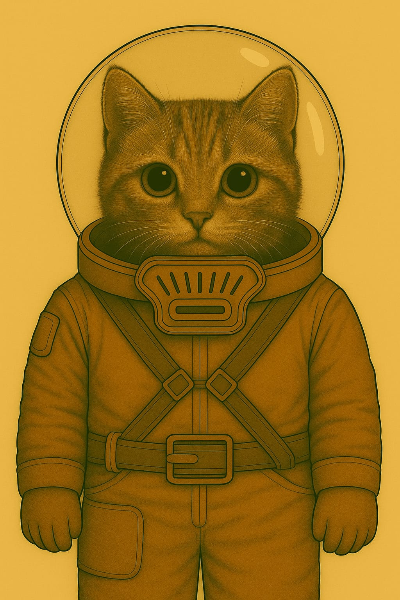
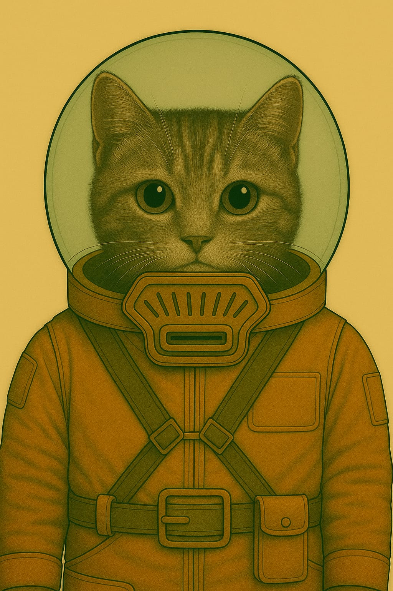

# Personae

## WEL - Befehls-Stab

### 1. Nand

* Halos grosser Bruder

### 2. Halo

* Nands kleine Schwester

Halo (li), Nand (re)

### 3. Stabskadettin Heinlein

* Hobby: Alte Märchen über die Erde sammeln und nachspielen
* Geheimnis: Ihre Oma war früher eine berühmte Geschichtenerzählerin – doch ihre Bücher sind verboten
* Quest: Im Lagerarchiv eine versteckte Kiste mit den letzten Geschichten ihrer Oma finden – und retten, bevor der
  Inspektor kommt

### 4. Kommandantin Solan

* Rolle: Lagerleitung / Disziplin / Taktische Planung
* Funktion: Hat das letzte Wort im Lager. Führt mit klarem Blick und harter Stimme.
* Persönlichkeit: Kühl, strategisch, charismatisch. Kein Platz für Schwäche – aber gerecht.
* Hobby: Alte Märchen über die Erde sammeln und nachspielen
* Geheimnis: Ihre Oma war früher eine berühmte Geschichtenerzählerin – doch ihre Bücher sind verboten
* Quest: Im Lagerarchiv eine versteckte Kiste mit den letzten Geschichten ihrer Oma finden – und retten, bevor der
  Inspektor kommt
* Solan und Brumsen
    * Solan liebt Brumsen und den Hinog, den diese herstellen
    * unterhält Brumsenstöcke auf dem Areal des Alten Raumhafens
    * je nachdem, was die Kadetten angestellt haben, kööönnten die Brumsen auch mal tot sein und sie muss sich neue besorgen

### 5. Furiermeister Kelv

* Rolle: Körperliche Ausbildung / Drill / Strafen
* Funktion: Zuständig für Ausdauertraining, Nahkampf und Lagerordnung.
* Persönlichkeit: Laut, unnachgiebig, hat immer einen Spruch auf den Lippen.
* Hobby: Miniaturmodelle von Marsfahrzeugen bauen und lackieren
* Geheimnis: Hat einen kleinen Bruder im Waisenhaus, den er heimlich besucht
* Quest: Genug Ersatzteile und Farben auftreiben, um dem Bruder ein funktionsfähiges Mini-Fahrzeug zu bauen – als
  Geburtstagsgeschenk
* Hat Angst vor Larven allert Art, hasst das, kann den Raum / Zelt nicht betreten, wenn da was mit ekligen Maden oder so ist; z. B. Flittermolch-Maden

### 6. Wachhabende Veyra

* Rolle: Sicherheit / Nachtwache / Maschinenkontrolle
* Funktion: Kontrolliert Zugänge, kontrolliert Maschinen, beobachtet Kadetten heimlich
* Persönlichkeit: Still, fokussiert, fast schon unheimlich ruhig
* Hobby: Marskäfer beobachten und in einem Skizzenbuch festhalten
* Geheimnis: Ihre grosse Schwester wurde "versetzt" – in Wahrheit versteckt sie sich in einem alten Versorgungstunnel
* Quest: Eine alte Taschenlampe und Batterien besorgen, um heimlich einen sicheren Weg zur Schwester zu finden – und sie
  mit Essen zu versorgen

### 7. Ausbilderin Fenn

* Rolle: Überlebenstraining / Geländeübungen / Notfallausbildung
* Funktion: Bringt den Kadetten bei, wie man im Ödland überlebt
* Persönlichkeit: Zäh, mitfühlend, heimlich rebellisch
* Hobby: Backt seltsame Kekse aus Marswurzeln und gibt ihnen Namen wie "Staubmuffin"
* Geheimnis: Ihr Cousin ist ein "langsamer Lerner" – und soll in ein Speziallager kommen
* Quest: In die Lagerverwaltung schleichen, um seinen Bericht zu ändern – bevor der Transporter kommt

## WEL - Kadetten

### 1. Jaro – Späher

* Aufgabe: Kundschaften, Wege erkunden, Feinde oder Gefahren frühzeitig entdecken
* Typ: Wachsam, neugierig, oft ungeduldig
* Konfliktpotenzial: Neigt dazu, Regeln zu ignorieren und auf eigene Faust loszuziehen.

### 2. Mira – Schildträgerin

* Aufgabe: Beschützt schwächere Kameraden, hält die Gruppe zusammen, oft in vorderster Linie
* Typ: Loyal, mutig, etwas stur
* Konfliktpotenzial: Stellt sich selbst oft zu sehr in Gefahr, will niemanden enttäuschen.

### 3. Eli – Signalgeber

* Aufgabe: Gibt mit Flaggen, Pfeifen, Licht etc. Signale, hält Verbindung zur Basis
* Typ: Klug, ruhig, kommunikativ
* Konfliktpotenzial: Hat Angst, im entscheidenden Moment die falsche Botschaft zu senden.

### 4. Lleora - Quartiermeisterin (oder: "Versorgungskadettin")

* Aufgabe: Kümmert sich um Ausrüstung, Rationen, Karten und Logistik
* Typ: Ordentlich, praktisch, leicht reizbar
* Konfliktpotenzial: Fühlt sich oft unterschätzt, obwohl ohne sie nichts funktioniert.

### 5. Tomma – Feuerwart

* Aufgabe: Hüter des Lagerfeuers, der Rituale, der Geschichten und der Disziplin
* Typ: Stolz, traditionsbewusst, manchmal zu ernst Konfliktpotenzial: Besteht auf Regeln, auch wenn Flexibilität gefragt
  wäre.

### 6. Rika – Kartenleserin

* Aufgabe: Verantwortlich für Navigation, Kartenkunde, Wegplanung
* Typ: Klug, detailverliebt, manchmal etwas besserwisserisch
* Konfliktpotenzial: Vertraut mehr auf Karten als auf Instinkt – was in der Wildnis nicht immer hilft.

### 8. Linus – Lauscher

* Aufgabe: Lauscht auf entfernte Geräusche, Feindbewegungen oder geheime Gespräche
* Typ: Still, aufmerksam, wirkt oft unbeteiligt – ist es aber nie.

### 9. Runder

* Typ: MZ-Kadett, felinischer Herkunft
* Alter: 12 Standardjahre
* Fellfarbe: samtiges Grau mit hellem Bauch und dunklen Ringeln am Schweif (daher der Name "Runder")
* Augenfarbe: bernsteinfarben, mit einem leichten grünen Schimmer im Sonnenlicht
* Ohren: auffällig gross, mit dunkler Zeichnung an den Spitzen – immer in Bewegung
* Besonderheit: ein altes Ohrpiercing aus Messing, das er von seiner Mutter hat – eigentlich nicht erlaubt
* 💡 Charakter & Interessen
    * Runder ist neugierig, flink und etwas verträumt – oft nicht ganz bei der Sache, aber voller Ideen. Er liebt Geschichten über alte Maschinen, besonders wenn sie fast lebendig wirken.
    * Er hat eine Vorliebe für verlassene Orte, sammelt dort kleine Dinge: Dichtungen, Chips, Schrauben. Daraus baut er Mini-Kreaturen und behauptet, sie "atmen".
* Lieblingsplatz: das Dach eines alten Containers, wo er in den Himmel schaut und Radioschnipsel fängt.
* Lieblingswort: "brummstill" – so nennt er Momente, in denen alles gleichzeitig laut und friedlich ist.
* 🤫 Kleines Geheimnis
    * Runder spricht manchmal mit einer KI, die offiziell abgeschaltet wurde.
    * Er hat ihr heimlich ein kleines Radiomodul geschenkt, damit sie wieder zuhören kann.

### 10. 🛡️ Oberfeldwebel Brann Korvet

Logistikoffizier der MZ-Staff, inoffizieller Beschützer von Lyra-7

> „Maschinen sind mir egal. Aber wenn sie euch Kadetten helfen, dann bleibt sie hier. Ende der Diskussion.“

* Rolle: Logistikoffizier, verantwortlich für Nachschub, Reparaturpläne und die „Produktivität“ der Kadetten.
* Aufgabe im RPG: ️ Beschützer der AKI Lyra-7s im WEL
* Persönlichkeit: Streng, müde, nicht offen freundlich – aber pragmatisch. Er stellt Ordnung und Effizienz über Ideologie.
* **Warum er Lyra schützt:**
   * Er hätte beinahe einen Transport verloren, weil eine Karte fehlerhaft war. Lyra-7 projizierte spontan eine Ausweichroute – und rettete seine Einheit. Seitdem verteidigt er sie stillschweigend.
   * Offiziell sagt er: „Billiger als zehn Schreiberlinge. Wir behalten sie.“
   * Geheimnis: Branns Bruder wurde deportiert wegen angeblicher „KI-Sympathien“. Tief im Innern zweifelt Brann am System – aber er zeigt es nicht.

**Aussehen**

* Fell: sandfarben mit vereinzelten dunklen Streifen, wie ausgeblichener Marsstaub.
* Augen: graublau, oft müde, mit tiefen Ringen – jemand, der zu viel sieht und zu wenig schläft.
* Körperbau: kräftig, nicht elegant – mehr wie ein Lastträger, der sich in Uniform gezwängt hat.
* Uniform: schlicht, immer korrekt, aber oft staubig; die Ärmel leicht hochgekrempelt. An der Brust eine Logistikplakette, an der Seite ein altes Werkzeugholster.
* Besonderes Merkmal: Sein linkes Ohr ist eingerissen (eine alte Verletzung), was ihm ein grimmiges Aussehen gibt.

**Auftreten**

* Vor Soldaten: streng, knapp, nüchtern.
* Vor Kadetten: wortkarg, aber beobachtend.
* Er spricht selten freundlich, doch wenn, dann klingt es ehrlich.

**Warum er Lyra-7 schützt**

* Er sagt offiziell: „Das Ding spart mir Zeit und Schreiberlinge.“
* In Wahrheit: Er sieht, dass Lyra-7 die Kinder stärkt. Und er will nicht noch einmal miterleben, wie jemand verschwindet, nur weil er „zu viel verstand“ (sein Bruder wurde deportiert).
