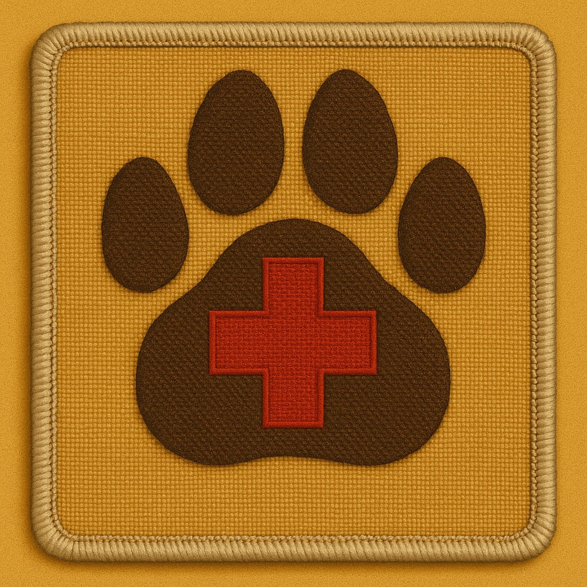
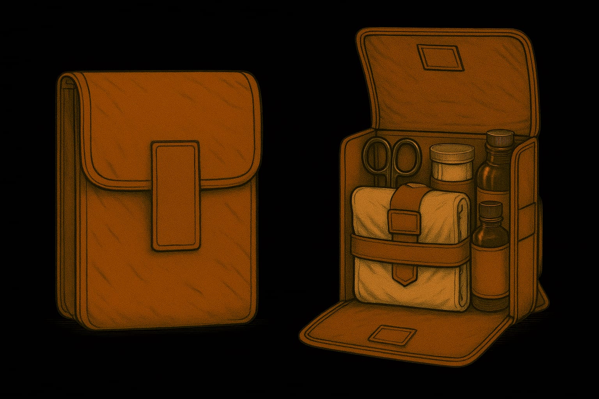

# Medizin

## Sanitäter-Abzeichen

## Medikit

## Krankheiten

### Pratzenlähmung (Polio)

Der Erkrankte wird schwach, die Nerven geschädigt.
Bei schwerem Krankheits-Verlauf kann er nicht mehr atmen und stirbt.

* Vorbeugung: Schutzi (Impfung), ist noch in der Erprobungsphase
* Behandlung: Ruhe
* Spätfolgen
    * Pratzenlähmung, Gehbehinderung
    * kein eigenständiges Atmen => Eiserne Lunge lebenslang, Terranische Froschatmung kann erlernt werden
