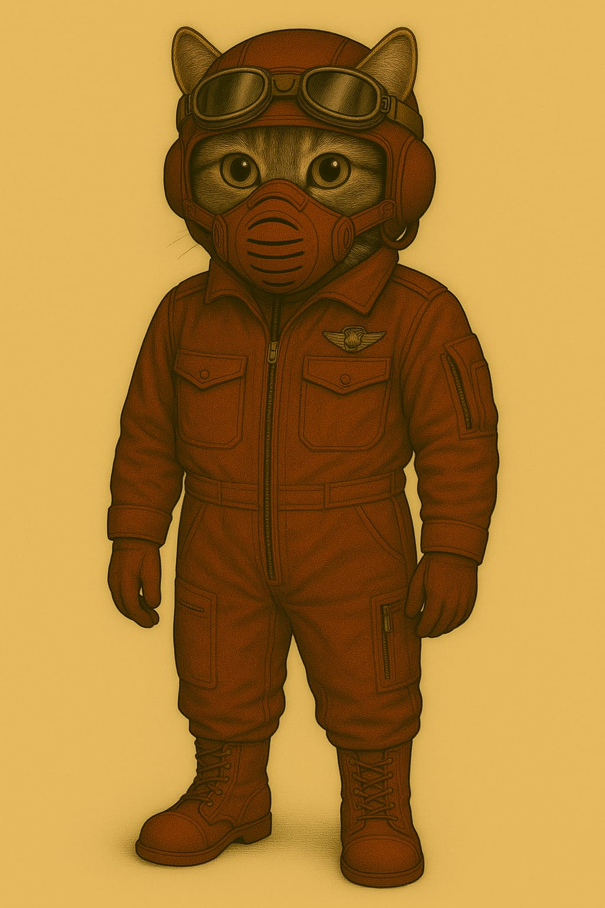
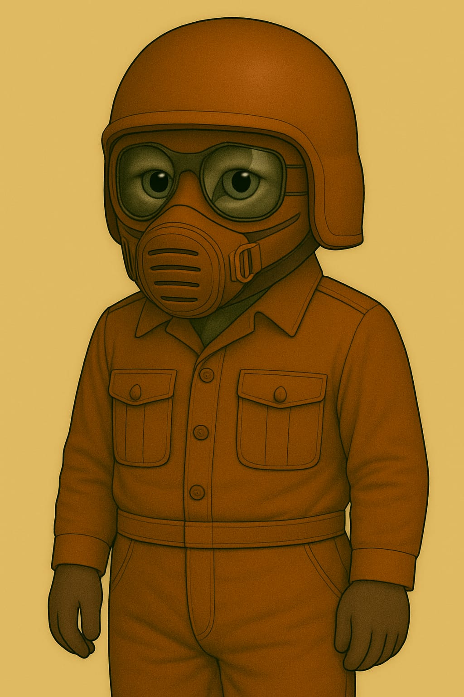
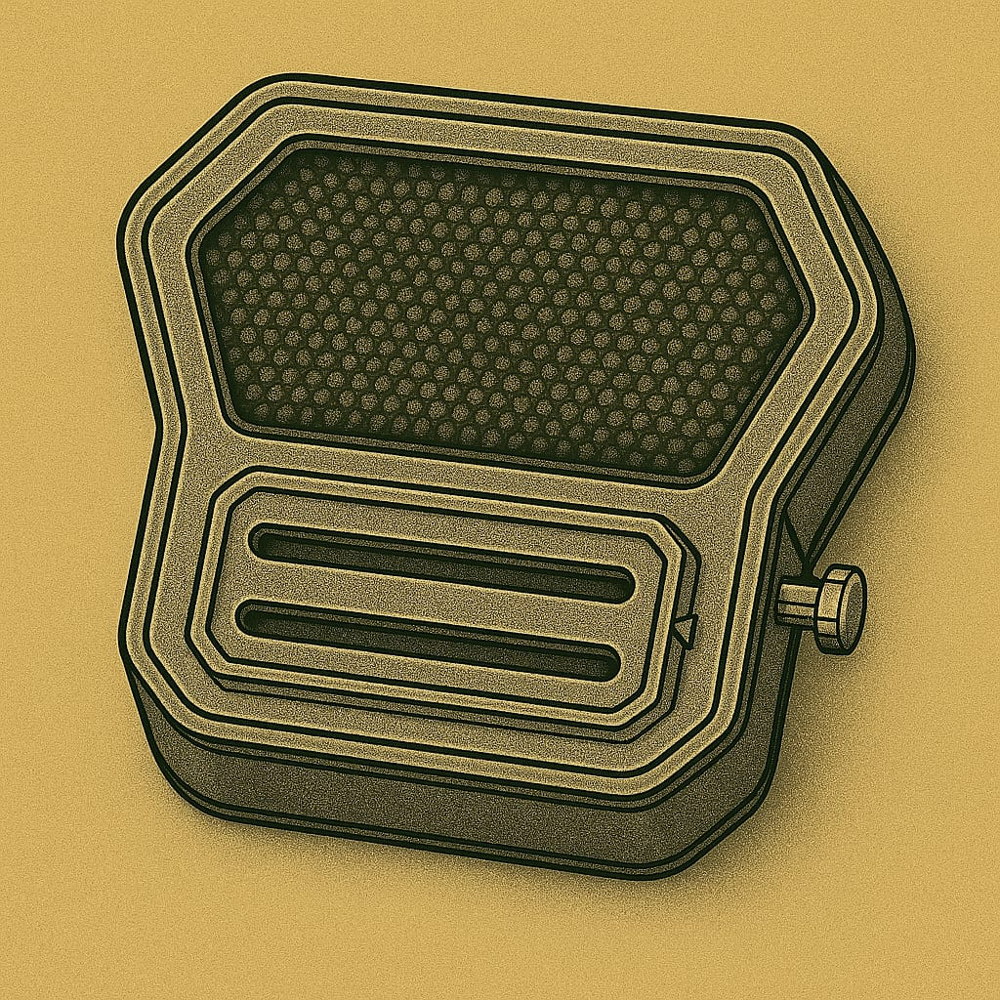

# Helme

## Leichtatmer mit Helm

## Panzerhelm eines Soldaten - Typ 1

## 🛡 Panzerhelm eines Soldaten - Typ 3

Vollschutzhelm aus hochstabilem Verbundmaterial mit integriertem Panorama-Visier. Bietet maximalen Schutz bei Stürzen, Staubeinwirkung und extremer Sonneneinstrahlung. Kompatibel mit dem externen Anzugs-Filtersystem "Typ 5". Ideal für Ausseneinsätze unter harschen Umweltbedingungen.

## 🛡 Schutzkappe des Lazerett-Piloten (LP)

Hartfaser-Kopfschutz mit leichtem Kinnvisier. Schützt bei Stürzen und vor Sonnenstichen im Freien.

* Verwendung: Innenbereiche · Werkdienst · Appelle · Kurzzeitiger Ausseneinsatz

Diese Schutzkappe ist ein leichter Hartfaserhelm für den täglichen Gebrauch in Habitaten, technischen Bereichen und bei kurzen Wegen im Freien. Sie vereint grundlegenden Kopfschutz mit Tragekomfort und ist für den Einsatz mit dem Leichtatmer (L-F1) konzipiert.

**🔩 Designmerkmale**

* Form: Kompakte Halbschale mit tiefgezogenem Nacken- und Schläfenschutz.
* Visier: Fest montierte, integrierte Schutzbrille mit grossem Sichtfeld – geeignet für den Einsatz bei hoher Helligkeit und leichtem Staubeintrag.
* Kinnbereich: Flaches, stabiles Kinnvisier mit direkter Leichtatmer-Anbindung (Riemenführung aussenliegend).
* Farbe: Kolonie-standardisierte Uniformfarbe (rostrot / terrakotta).
* Innenpolsterung: Leichte, stossabsorbierende Auskleidung – angenehm zu tragen, auch über längere Zeiträume.

**🛠️ Technische Daten**

* Material: Gepresste Hartfaser mit mineralischer Aussenbeschichtung
* Gewicht: ca. 900 g
* Schutzwirkung:
    * Reduziert Verletzungsrisiken bei Sturz aus Standhöhe
    * Schirmt direkte Sonnenstrahlung ab (UV-reduzierend)
    * Kein Schutz bei Hochgeschwindigkeits- oder Vakuumbelastung
* Kompatibilität: Leichtatmer (L-F1-Serie)

**⛑️ Einsatzprofil**

Die Schutzkappe "Typ 3" wird regelmässig getragen bei:

* Kontrollgängen und Arbeitsschichten im Innenbereich * Appellen, Befehlsausgaben und Sicherheitsinspektionen
* Kurzen Gängen zwischen Habitatmodulen oder auf abgeschirmten Aussenplattformen

Hinweis:
Nicht für Ausseneinsätze mit starker Windbelastung oder Temperaturschwankungen vorgesehen. Kein Ersatz für vollisolierte Raumhelme.

## Helm mit Kommunikations-Einheit

Kopfhörer aussen am Helm und ein Mikrofon das magnetisch von aussen am Filter befestigt wird.

## Filtereinsätze für Helm

## Helm "Typ 3" – Vollschutzhelm für erweiterten Ausseneinsatz

Verwendung: Erweiterte Ausbildungsexpeditionen · Marsoberfläche · Einsätze mit erhöhtem Schutzbedarf

**🧰 Allgemeines**

Der Helm "Typ 3" ist ein vollständig umschliessender Ausseneinsatzhelm für Kadetten, die unter harschen Umweltbedingungen operieren. Er wird als Ergänzung zum regulären Kadettenhelm "Typ 2" eingesetzt und bietet erweiterten Schutz gegen mechanische Einwirkungen, Staubstürme und UV-Strahlung. Der Helm ist für längere Tragedauer optimiert und auf maximale Robustheit ausgelegt.

**⚙ Aufbau & Material**

* Helmschale:
    * Aus hochstabilem Mehrschicht-Verbundmaterial gefertigt
    * Stossfest, temperaturstabil und staubresistent
    * Innenausstattung mit Polsterung und abgedichtetem Kragenring
* Kragenanschluss:
    * Bajonett-Verriegelung zur festen Kopplung mit Ausseneinsatzanzügen
    * Innenliegende Abdichtung gegen Staub und Luftverlust

**👁 Visiersystem**

* Sichtfeld:
    * Integriertes Panorama-Visier für erweitertes Frontalfeld
    * Kein Scharnier – der Helm wird komplett auf- oder abgesetzt
* Beschichtung: UV-Schutz, Anti-Kratz- und Anti-Beschlag-Oberfläche
* Seitensicht: Eingeschränkt – daher kombinierbar mit Sichtzeichen in der Ausbildung

**🔉 Kommunikation**

* Funkintegration:
    * Kein internes System
    * Nur nutzbar mit dem externen Kadetten-Funkmodul "K-Radio/01"
* Lautsprecherübertragung:
    * Sprache wird aussen über Lautsprecher eingespielt
    * Schallübertragung in den Innenraum erfolgt über Helmvolumen
    * Verständigung ist abhängig von Position, Geräuschumgebung und Helmresonanz

**📦 Einsatzprofil**

* Genutzt bei:
    * Staub- und Sturmübungen
    * Langstreckenmärschen unter Anleitung
    * Ausseneinsätzen mit hohem Schutzbedarf (z. B. Marswind, Trümmerzonen)

Wird anstelle des Typ 2 getragen, wenn erhöhter Schutz oder längere Einsatzdauer erforderlich sind.
