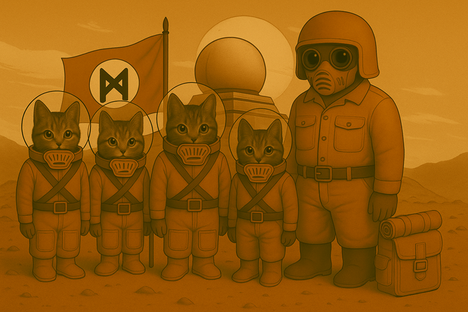
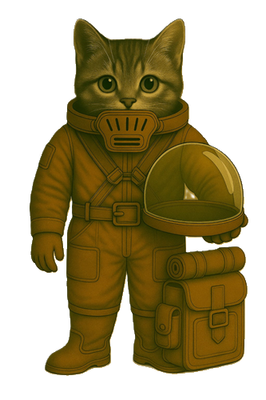
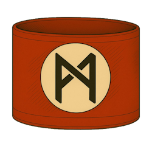
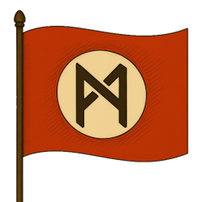

# Staubpfoten

## 🎭 Das Rollenspiel

Hab Spass auf dem Mars! Erlebe Gefahren und Abenteuer! Und wie weit wirst du gehen, um den Mars und das Marser Volk zu retten?

Das Rollenspiel in Stichpunkten erklärt:

1. Du bist eine Katze auf zwei Beinen.
2. Du lebst auf dem Mars. Die Atmosphäre des Mars ist giftig und darum brauchst du einen Schutzanzug.
3. Der Marsianische Zephir herrscht über den Mars. Er ist wahnsinning und hat einen Krieg angezettelt.
4. Du bist zwangsweise Mitglied in der Kadettschaft. Dort sollst du zu einem ordentlichen, wehrfähigen Soldaten erzogen werden.
5. Irgendwann merkst du, dass das alles irgendwie gar kein Spiel ist. Was wirst du tun?

{ style="float:right; width:50%;" } **Besonderheit**: Jeder Charakter hat eine eigene Behinderung oder **Einschränkung** – **körperlich oder geistig**. Dies ist nicht nur ein Merkmal, sondern beeinflusst Spielweise, Entscheidungen und Lösungen.

**Ambience Sound zu Mars, Krieg und Raumschiff**

  <audio controls preload="auto">
    <source src="assets/audio/nand-echo.ogg" type="audio/ogg">
    Dein Browser unterstützt das Audio-Element nicht.
  </audio>

## 🔴 Mars, 2045

Die unendliche Weite des Horizonts. Überspannt vom sanft grünen Himmel.  Der Sand und all die verschiedenen Farbtöne des Sands. Ocker. Ziegel. Dunkel. Braun. Bromig. Hier bist du geboren. Auf dem Mars.

Es riecht nach Brom. Denn dein Filter ist alt. Du solltest ihn schon länger ersetzt haben. Das Brom ist bitter ... und ätzend.

>Ihr schlüpft in die Rollen **Marser Kinder**.
>Marser sind Feline mit Fell, Schwarz und Schnurrhaaren.
>Erlebt ein wundervolles Abenteuer – und macht die Welt ein bisschen besser!

{ style="float:right; width:50%;" }

Die Handlung spielt auf dem Mars, in einer nahen Dimension. Du bist ein Feliner, der auf dem Mars lebt; also eine Katze auf zwei Beinen im Schutzanzug.

Der Mars steht kurz vor dem Krieg beziehungsweise es ist schon Krieg. Und du bist Mitglied der sogenannten MZ-Kadettschaft, einer paramilitärische Gruppierung zum Heranziehen von Soldaten.

Und das heisst Spass. Nachmittägliche Gruppenstunden, mehrtägige Wehrertüchtigungslager, HR-Führerschein! Besonders toll ist, dass ihr bald richtige Aufträge bekommt. Zum Beispiel KI überwachen oder gleich selbst zu plasmieren.

Nieder mit den KI!

(Oder auch nicht!)

## Disclaimer

### 🛸️ Erklärung zum Spielsystem und seiner historischen Einordnung

{ style="float:left;width:50%;margin-right:25px" }Dieses Spielsystem wurde mit einem klaren Ziel entwickelt: Aufklärung durch kritische Auseinandersetzung. Die darin enthaltenen Elemente diktatorischer Systeme – etwa Kontrolle, Propaganda, Gehorsam oder Gewaltmonopol – sollen nicht ästhetisiert oder romantisiert, sondern offengelegt und hinterfragt werden.

Gerade in Zeiten, in denen demokratische Werte wieder unter Druck geraten, halten wir es für notwendig, auch über spielerische Mechaniken zu vermitteln, wie gefährlich totalitäre Ideologien sind.

Unser Spielsystem verherrlicht in keiner Weise die Greueltaten oder Ideologien des Dritten Reichs. Im Gegenteil: Wir verfolgen mit diesem System einen klar aufklärerischen Ansatz. Ziel ist es, insbesondere jungen Menschen auf eindringliche Weise bewusst zu machen, wie gefährlich diktatorische Systeme wie jenes des Nationalsozialismus sein können.

Dabei sehen wir unser Spiel in einer ähnlichen Tradition wie der Roman "Starship Troopers" von Robert Heinlein, der häufig missverstanden wird, tatsächlich jedoch zur kritischen Auseinandersetzung mit autoritären Gesellschaftsformen einlädt.

Ergänzend dazu: Der besondere Wert unseres Ansatzes liegt in der Verbindung von spielerischem Zugang und historischer Sensibilisierung. Diese Herangehensweise hat viele Teilnehmer beeindruckt – sie macht Geschichte erlebbar, ohne sie zu trivialisieren.

### ⚠️ Triggerwarnungen

* Ideologie
* Gruppenzwang
* Verrat
* Irrtum
* Tod
* Body-Horrer / Missgestaltung des Körpers
* Ungerechtigkeit gegenüber Minderheiten
* Zweifel
* Ungewissheit
* Gewalt gegen alles Mögliche, was der Ideologie widerspricht

### 🜁 Hintergrund

Die Grundstimmung und viele Themen basieren auf den Kriegserlebnissen von Ferdinand Riegel, dem Vater der Autorin des Buches "Ich bin Nand" sowie dieses Rollenspiels. Seine Erfahrungen und Erkenntnisse aus dem 2. Weltkrieg geben dem Spiel eine ehrliche, emotionale Tiefe.

Nicht zuletzt hast du in diesem Rollenspiel die Chance, kleine Fluchten und Rettungen zu ermöglichen. Denn hier wie im richtigen Leben gilt: Die Welt immer ein bisschen besser machen. Und Entscheidungen treffen, die damals getroffen hätten werden sollen.

## 🛡️ Nie wieder!

> Dieses Spielsystem wurde mit dem ausdrücklichen Ziel entwickelt, **kritische Auseinandersetzung mit totalitären Strukturen** zu ermöglichen.
Es zeigt bewusst Elemente wie **Kontrolle, Propaganda, Gruppenzwang** und die **Unterdrückung von Individualität** – nicht zur Verherrlichung, sondern zur **Reflexion**.

In einer Zeit, in der **autoritäres Denken**, **Verschwörungsideologien** und **politische Radikalisierung** wieder zunehmen, sehen wir es als unsere Verantwortung, neue Wege der **historischen und politischen Bildung** zu gehen.
Unser Spiel soll **bewusst machen**, wie diktatorische Systeme entstehen, funktionieren – und wohin sie führen können.

Dabei **distanzieren wir uns ausdrücklich** von jeder Form der Verherrlichung des Dritten Reichs oder seiner Ideologie.
Vielmehr ist es unser Ziel, insbesondere **junge Menschen für die Gefahren von Faschismus, Diskriminierung und ideologischer Verblendung** zu sensibilisieren.

## 🎓 Inspirationsquellen

Wir sehen uns damit in der Tradition aufklärerischer Werke wie:

- **„Starship Troopers“** von *Robert A. Heinlein*, der oft missverstanden wird, aber zur kritischen Auseinandersetzung mit Militarismus und gesellschaftlicher Organisation einlädt.
- **„1984“** von *George Orwell* und **„Fahrenheit 451“** von *Ray Bradbury*, die zeigen, wie Sprachkontrolle, Informationsunterdrückung und Angst autoritäre Systeme stützen.
- **„V – Die außerirdischen Besucher kommen“**, das in Science-Fiction-Hülle deutlich macht, wie sich faschistische Strukturen schleichend etablieren – und wie Widerstand dagegen wächst.
- **„Herr der Fliegen“** von *William Golding*, das eindrucksvoll zeigt, wie schnell soziale Ordnung zerfallen und in Gewalt umschlagen kann, wenn Macht unreflektiert bleibt.

Unser Spiel vermittelt diese Themen **nicht abstrakt**, sondern durch **erfahrbare Mechaniken**, **moralische Dilemmata** und **narrative Konflikte**.
So werden **Verantwortung, Mitläufertum, Widerstand und Unrecht** spielerisch erfahrbar gemacht – **ohne Leid oder Gewalt zu trivialisieren**.

## 🌍 Diversität & Inklusion

Dieses Rollenspiel wurde mehrfach beim Rollenspieltreff des Rollenspielvereins Freiburg angeboten – die Rückmeldungen waren durchweg positiv.

Es legt besonderen Wert auf Vielfalt, sowohl im Hinblick auf queere Identitäten (LGBTQIA+) als auch auf die bewusste Einbeziehung von Menschen mit Behinderungen.

Im Spiel hat jede Figur eine Form von Behinderung oder Einschränkung – körperlich, sensorisch oder psychisch. Denn Einschränkungen gehören zum Leben vieler Menschen.

Das Besondere: Du entscheidest selbst, welche Behinderung dein Charakter hat und wie sie sein Leben beeinflusst.

* Spielende ohne eigene Behinderung können dadurch Erfahrungen sammeln, die einen Perspektivwechsel ermöglichen – zum Beispiel, wie es ist, nicht sprechen zu können oder sich aufgrund sozialer Ängste nicht mitteilen zu können.
* Spielende mit Behinderung können neue Sichtweisen ausprobieren, unterschiedliche Formen von Behinderung erleben und einfach Spaß haben – während andere erleben, was alltägliche Barrieren bedeuten können.

So entstehen <strong>Empathie</strong>, <strong>Perspektivwechsel</strong> und <strong>ein Gefühl für Inklusion,</strong> das über reine Information oder historischen Kontext hinausgeht.

## 🎲 Spiel-Erfahrungen

Im monatlichen Rollenspielteff des Rollenspielvereins Freiburg habe ich dieses System / Rollenspiel mehrmals  angeboten. Die Rückmeldungen waren durchweg positiv.

Hier einige Reaktionen und Situationen, die sich am Spieltisch ergeben haben:

* Diskussionen über das 3. Reich
* Rekapitulation des 3. Reichs und der Propaganda-Struktur. U. a. mit Schülerin, die dieses Thema gerade im gesamten Schuljahr in verschiedenen Unterrichtsfächern beleuchten durfte.
* Ganz süss, zwei Spieler*innen (mit Behinderungen) waren entzückt: "Schau mal, wir können uns unsere Behinderungen aussuchen!!"
* Erfahrungen im Mitläufertum: hilflose und schliesslich plasmierte KI; aus purem Eigennutz vernichtet (da war selbst ich als Meister baff). Empörung der Mitstreiterin: "Wir gründen eine Weisse Rose" (zur Rettung der KI)

## 📌 Fazit

Wir verstehen unser Spiel als **Beitrag zur politischen Bildung**, zur **Stärkung demokratischer Werte** und zur **Wachsamkeit gegenüber ideologischer Verführung.

  <strong>❗ Nie wieder </strong> ist kein leeres Wort ❗
   
  Sondern eine <strong>Haltung</strong>, die man lernen, verstehen und leben muss.
   
  Unser Spielsystem will genau das ermöglichen.

