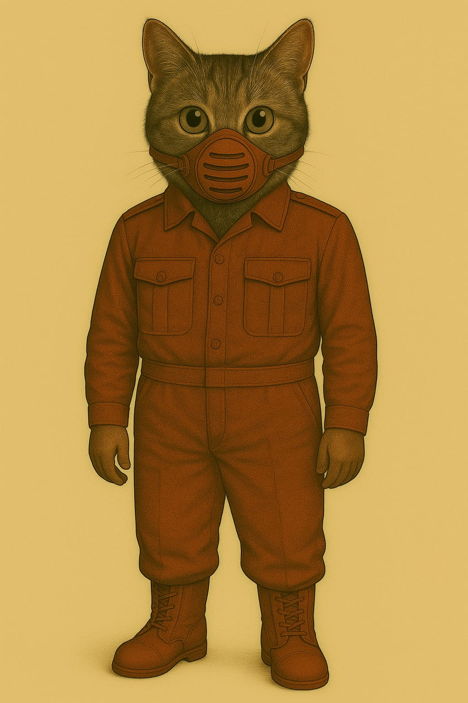

### Standard-Feldanzug (Innen- & Unteranzug)

Verwendung: Habitatbetrieb · Appelle · Technikbereiche · Unteranzug für Ausseneinsätze

**🧰 Funktionaler Überblick**

Der Standard-Feldanzug ist ein einheitlich gefertigtes Bekleidungsstück für den täglichen Einsatz auf dem Mars. Er dient primär als Innenraum-Uniform für alle Aufgaben innerhalb von Habitaten und Stationen – inklusive Verwaltung, Technik, Medizin, Versorgung oder Sicherheit. Gleichzeitig ist er als Unteranzug für längere Ausseneinsätze vorgesehen: Er wird direkt unter einem externen Schutzanzug (z. B. Raumanzug, Exo-Einsatzsystem) getragen und bietet dafür ideale Kompatibilität.

#### 🧥 Oberteil – Uniformjacke

* Farbe: Dunkel-terrakottafarbener Ton – erkennbar, traditionsbewusst, schmutzunempfindlich.
* Material: Hochreissfestes, atmungsaktives Mischgewebe mit Staubschutzbeschichtung und guter Thermoisolierung.
* Ausstattung:
    * Front: durchgehende Knopfleiste mit flachen Druckknöpfen (auch unter Exoanzügen nicht störend).
    * Kragen: klassisch, flachliegend – vorbereitet für Kragenfilter, Innenhelmeinlass oder Kommunikationsaufsatz.
    * Taschen: Zwei Brusttaschen mit Patten – flach gehalten, um unter Anzügen nicht aufzutragen.
    * Schultern: mit interner Verstärkung zur Druckverteilung bei Tragesystemen oder Rucksackmodulen.

#### 👖 Unterteil – Hose

* Schnitt: Körpernah, aber bewegungsfreundlich. Beine verjüngt, Abschluss für Stiefeloptimierung.
* Details:
    * Seitliche Eingrifftaschen.
    * Verstärkte Knie- und Gesässbereiche (besonders nützlich beim Kriechen oder langen Tragen).
    * Gürtelbereich: kompatibel mit Innenriemen oder Versorgungsverkabelung.
* Anwendung: Die Hose kann dauerhaft getragen und einfach in einen Aussenschutz integriert werden (kein Umziehen notwendig).

#### 🥾 Stiefel

* Modell: Mars-Innenstiefel, robust und komfortabel.
* Funktion: Ausgelegt für Alltag und kurzzeitigen Ausseneinsatz.
* Merkmale:
    * Weicher Schaftabschluss zum Andocken von Aussengamaschen oder Anzugabdichtungen.
    * Rutschhemmend, hitzebeständig.
    * Schnellschnürung für schnelles An- und Ausziehen in Luftschleusen.

#### 😷 Leichtatmer (L-F1-Serie)

* Typ: Halbmaske mit Basisstaubfilter.
* Funktion: Schutz bei reduzierter Filterleistung im Inneren, leichten Leckagen oder auf kurzen Aussenwegen.
* Design: Elastische Bänder, flaches Filterprofil, kompatibel mit der leichten Schutzkappe oder dem Pilotenhelm-System.
* Besonderheit: Kann im Aussenbereich weitergetragen werden, wenn der externe Helm abgenommen wird (z. B. zur Wartung oder Erholung).

#### 🔧 Modularität & Schichtung

* Innentragung: Unter Exo-, Raum- oder Versorgungsanzügen.
* Schichtkonzept:
    1. Unterwäsche (technisch oder leicht isolierend)
    2. Feldanzug (dieses Modell)
    3. Aussensystem (Anzug, Versorgung, Schutz)
* Der Feldanzug ist so gefertigt, dass er weder scheuert noch staut, auch bei stundenlangem Tragen unter Druckanzügen. Schweiss wird nach aussen geleitet, Druckstellen werden durch den Schnitt vermieden. Die Oberfläche reduziert Reibung zu Aussenanzügen.
