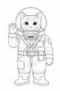

# Charaktererstellung

## Charakterbogen

|              | Farbig                                                            | Schwarz-Weiss                                                | Hellgrau                                                                 | Handgemalt                                                                  | Printed                                                          | Malvorlagen                                            |
| ------------ | ----------------------------------------------------------------- | ------------------------------------------------------------ | ------------------------------------------------------------------------ | --------------------------------------------------------------------------- | ---------------------------------------------------------------- | ------------------------------------------------------ |
| **Download** | [PDF](../_downloads/charakterbogen/charakterbogen-ki-rot.pdf)     | [PDF](../_downloads/charakterbogen/charakterbogen-ki-sw.pdf) | [PDF](../_downloads/charakterbogen/charakterbogen-ki-hellgrau.pdf)       | [PDF](../_downloads/charakterbogen/charakterbogen-ki-handgemalt.pdf)        | [PDF](../_downloads/charakterbogen/charakterbogen-printed.pdf)   | [PDF](../_downloads/charakterbogen/malvorlagen.pdf)    |
| **Vorschau** |  |  |  |  |  |  |

## Wer bist du?

Bevor dein Abenteuer beginnt, erschaffst du deinen eigenen Marser-Kadetten. Du brauchst dazu nur einen Stift, den Charakterbogen und einen sechsseitigen Würfel (W6).

## 1. Name & Handzeichen

Jeder Marser hat einen Rufnamen (Vor- und Nachname) – und zusätzlich ein Handzeichen. Denn draussen im Anzug kann man kaum reden. Es ist also ein Gebärdenname, also ein Handzeichen, wie es gehörlose Menschen benutzen.
Schau dir echte Gebärden an und wähle einen Ausdruck, der zu deiner Figur passt. Zum Beispiel „schwarz“, weil dein Fell diese Farbe hat. Oder „schnell“, weil du eben besonders schnell läufst. Hier findest du gute Beispiele:

| [DGS-Lexikon Spreadthesign](https://spreadthesign.com)                         | [DGS-Lexikon Signdict](https://signdict.org)                         |                                                                                 |
|--------------------------------------------------------------------|----------------------------------------------------------|---------------------------------------------------------------------------------|
|  |  |  |
| Lexikon                                                            | Lexikon                                                  | Lernen                                                                          |

Wähle eine Gebärde, die zu deinem Marser passt. Alle in deiner Spielrunde sollen dein Handzeichen kennen.

## 2. Fellfarbe

Trage im Bogen die Fellfarbe und Fellmusterung (Streifen, Flecken) ein.

## 3. Alter

Du würfelst dein Alter aus: ** 1W6 + 6** Damit bist du am Anfang zwischen 7 und 12 Jahre alt. So alt sind die meisten jungen Kadetten.

## 4. Lebenspunkte

Deine Lebenspunkte würfelst du einmal aus: ** 2W6 + 5**

Das ergibt einen Wert zwischen 7 und 17.

* Wenn du dich **verletzt, dann verlierst** du Lebenspunkte.
* Du **erholst dich über Nacht** allmählich. Pro geschlafener Nacht bekommst du **½W6 (aufgerundet) Lebenspunkte zurück**.

## 5. Grundwerte

**Dein Charakter hat sechs Eigenschaften:**

| Abkürzung | Bedeutung         | Erklärung                                        |
|-----------|-------------------|--------------------------------------------------|
| KL        | Klugheit          | 	um Rätsel zu lösen oder etwas zu verstehen      |
| IN        | Intuition         | um etwas zu erahnen oder jemandem einzuschätzen  |
| KK        | Körperkraft       | 	um etwas zu bewegen oder zu kämpfen             |
| CH        | Charisma	         | um andere zu beeinflussen, sodass sie dich mögen |
| GE        | Geschicklichkeit	 | um auszuweichen oder ein Schloss zu knacken      |
| MU        | Mut	             | um zu sehen, ob du dich etwas traust             |

Du hast **15 Punkte**, die du frei auf diese sechs Werte verteilen kannst. Ein Wert darf am Anfang nie höher als 5 sein und nie niedriger als 1.

**Beispiel:** Rila verteilt ihre Punkte so: MU 3, KL 5, IN 2, CH 2, KK 1, GE 2. Sie ist also sehr klug und nicht besonders stark.

## 6. Fähigkeiten (Proben-Erleichterung)

Dein Charakter hat – wie wir auch – bestimmte Fähigkeiten, aber auch Dinge, die ihm das Leben schwer machen.
Du kannst zwischen drei und max. fünf Fähigkeiten für deinen Charakter selbst wählen. Du könntest zum Beispiel Fahrzeugsteuerung, Sicheres Auftreten und Staubschatten haben. Du kennst dich also mit Maschinen aus, andere mögen dich auf den ersten Blick, und du kannst dich gut verstecken.

## ⚙️ Technik & Maschinen

* Fahrzeugsteuerung  3
* Maschinenwartung  2
* Improvisationstechnik  1
* Sensoren & Scanner nutzen  2

## 🔥 Überleben & Umwelt

* Navigation im Ödland  3
* Hitzeresistenz  2
* Vorratsschätzung  1
* Staubsturm-Taktik  1

## 🧠 Wissen & Analyse

* Planetoforming-Wissen  2
* Mars-Geologie  2
* Feindliche Taktiken  2
* Codes und Systeme  1

## 🗣️ Team & Kommunikation

* Taktisches Denken  3
* Kaltblütig unter Druck  2
* Signalgeber  2
* Mentale Stärke  1

## 🤺 Kampf & Bewegung

* Nahkampf  3
* Waffenkenntnis  2
* Lautlos bewegen  2
* Schnelle Reaktion  1

## 🛠️ Spezialfähigkeiten

* Nachtblick  3
* Maschinensprache  2
* Feuerhand  1
* Staubschatten  1

## 🎨 Musische Künste

* Dichten  2
* Rhythmus und Helm-Kunst  1
* Lieder erfinden und singen  2
* Malen  1

## Negative Eigenschaften – ggf. würfeln

Suche dir mindestens 3 Behinderungen in derselben Wertigkeit aus, wie Du gute Eigenschaften hast.

**Beispiel**: Dein Charakter hat Fahrzeugsteuerung (3), Signalgeber (2) und Lautlos bewegen (2) => also insgesamt gute
Eigenschaften mit einer Wertigkeit von 3+2+2 = 7

Also wählst du Schwache Nachtsicht (1), Blind auf einem Auge und Lichtempfindlichkeit (3) und Künstliches Bein (3), also 1+3+3 = 7

Statt zu wählen kannst du auch einfach mit 2 W6 würfeln. Ggf. musst du ein bisschen anpassen, weil ich manche guten Eigenschaften und Behinderungen einander ausschliessn, z. B.Lautlos bewegen und Lärmverursacher.

### ⚠️ Kleine Behinderungen (1 Punkt)

(Leicht störend, situationsabhängig)

| Bezeichnung             | Erklärung                                                                 |
|------------------------|--------------------------------------------------------------------------|
| Schwache Nachtsicht    | Sieht in Dunkelheit deutlich schlechter als andere                      |
| Chronischer Husten     | Besonders bei Staub / Anstrengung                                       |
| Lichtempfindlich       | Grelle Helligkeit verursacht Schmerzen                                 |
| Leichter Sprachfehler  | Stottert oder spricht langsam                                          |
| Ungeschickte Hände     | Probleme mit Feinmotorik oder Technik                                  |
| Ungeduldig             | Verliert schnell die Nerven bei Wartezeiten oder Routine               |
| Lärmverursacher        | Bewegt sich laut, klappert oder tritt auffällig                        |
| Kleiner als andere     | Wird oft übersehen oder unterschätzt                                   |
| Sozial unbeholfen      | Wirkt merkwürdig, redet sich schnell in Schwierigkeiten                |
| Stauballergie          | Husten, Niesen, gereizte Augen                                         |
| Schwache Orientierung  | Verläuft sich leicht in unbekannten Umgebungen                         |

## ⚠️⚠️ Mittlere Einschränkung (2 Punkte)

(Haben klar spürbare Auswirkungen, aber noch mit Mühe ausgleichbar)

| Bezeichnung            | Erklärung                                                                 |
|------------------------|--------------------------------------------------------------------------|
| Schwache Lunge         | Bei Belastung schnell ausser Atem                                        |
| Paranoia               | Misstraut Teammitgliedern, sieht überall Verrat                         |
| Einäugig               | Eingeschränktes Sichtfeld und räumliches Sehen                          |
| Ungeübter Kämpfer      | Verliert in Nahkämpfen                                                  |
| Technikfeindlich       | Schwierigkeiten im Umgang mit Maschinen                                 |
| Traumatisiert          | Wird bei bestimmten Reizen handlungsunfähig                             |
| Schwerfällig           | Langsame Bewegungen, schlecht im Ausweichen                             |
| Anfallsleiden          | Gefahr von Anfällen unter Stress oder Reizen                            |
| Koordinationsstörung   | Ungeschickte oder verzögerte Bewegungen                                 |
| Schwache Muskeln       | Kann wenig tragen oder lange laufen                                     |
| Tremor (Zittern)       | Zittern erschwert präzise Arbeiten                                      |
| Angst vor Dunkelheit   | Panik oder starke Angst in dunklen Umgebungen                           |
| Entwicklungsverzögert  | Versteht vieles langsamer, braucht Hilfe                                |

### ⚠️⚠️⚠️ Grosse Behinderungen (3 Punkte)

(Massiv einschränkend, dominanter Teil der Figur)

| Bezeichnung                       | Erklärung                                         |
|-----------------------------------|---------------------------------------------------|
| Nicht sprechfähig                 | Kommuniziert über Gesten oder Hilfsmittel         |
| Lähmung ab Hüfte                  | Braucht Hilfsmittel, verletzungsgefährdet         |
| Beatmungsgerät                    | Auf regelmässige Maschinen angewiesen              |
| Massive PTSD / PTBS               | Panik oder Erstarren bei bestimmten Reizen        |
| Künstliches Bein                  | Eingeschränkte Beweglichkeit                      |
| Chronische Schmerzen              | Belastung nur eingeschränkt möglich               |
| Klaustrophobie                    | Panik in engen Räumen                             |
| Wutanfälle                        | Verliert in Stresssituationen die Kontrolle       |
| Maschinenhass                     | Verweigert Zusammenarbeit mit Technik/KI          |
| Psychische Instabilität           | Wahnvorstellungen oder Realitätsverlust           |
| Starke Entwicklungsverzögerung    | Stark eingeschränktes Verständnis                 |
| Blind auf einem Auge + lichtempf. | Kombination aus Sehfeldverlust und Lichtproblemen |
| Orientierungslos                  | Schlechte Orientierung auch in bekanntem Gelände  |

## Stufenanstieg

Nach jedem Abenteuer darfst du:

* einen zusätzlichen Punkt auf deine Eigenschaften vergeben; also z. B: KLugheit oder INtuition steigern
* zusätzliche positive Eigenschaft

Info: eine zusätzlich Behinderung musst du dir nicht auswählen. Das anfängliche Set-up ust genug. Natürlich kannst du dich **freiwillig** für ein weiteres Manko entscheiden. Tipp: bbringe dies in Bezug zum Abenteuer, also z. B. eine klaustrophobische Störung, weil du im letzten Abenteuer in einer klaustrophoibischen Situation warst.
