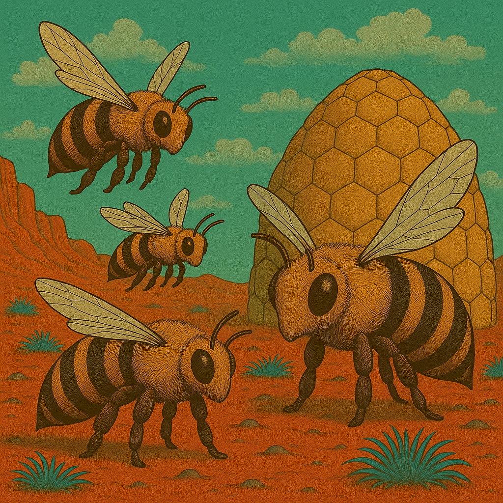

# Die Welt

* Mars, verseucht von Brom
* Feline Lebewesen leben dort, etwa einen Schritt gross
* alle mit Helm und Anzug, die mehr oder weniger in Schuss sind
* es herrscht Krieg im Sonnensystem
* 1 Schritt = 1 Meter

## Mars - Kurzbeschreibung

* Der Rote Planet
* Der Mars ist der zweite Planet zur Sonne, auch genannt der rote Planet. Und er ist über und über voller Brom.
* Der Mars kennt warme und kalte Jahreszeiten. Letztere wird angekündigt durch den sog. Bromsturz, eine Zeit des
  Sturms und bromgetränkten Winden.

## Kulturschaffende

Feline Wesen, die sich selbst "Marser" nennen.

## Zeitrechnung

* Dezimales System
* 1 Sol = 10 Stunden → 100 Minuten → 100 Sekunden
* Marsjahr = 10 Monate à ~66–67 Sols
* also sehr einfach zu rechnen! (für Terraner möglicherweise ungewohnt)

## Zählen

Auf dem Mars wird regelmässig gezählt: erst der Zehner, dann der einer, also:

* 10 zehn
* 11 zehn-und-eins
* 12 zehn-und-zwei
* 13 zehn-und-drei
* 23 zwanzig-und-drei
* 57 fünfzig-und-sieben
* 373759 dreihundert-siebzig-und-drei-tausend-siebenhundert-fünfzig-und-neun

Marser sind daher auch gut im Kopfrechnen, weil die Zahlen geordnet sind.

## Fauna

### Brumsen

### Plötzen

### Flittermolche

* legen Eier, bevorzugt auf Leichen und Kadaverb
* Flittermolch-Maden sind eklig

### Weitere

* Brumsen
* Molche
* Gallertkrabben
* Plötzen
* Echsenschupps
* Streitschupps
* Flieder
* Käfer
* Wasserfische

## Fauna

* Jerrybäume
* Schachtelhalme
* Pilze
* Blaugras

## Grosse Städte auf dem Mars

### Marsstadt

Marsstadt ist die plantare Hauptstadt des Mars

* Einwohner: ca. 4.320.000
* Tempel: über 300
* Militärische Einrichtungen:
    * Oberkommandos
    * Kasernen
    * Lufthäfen
    * Bunker
    * Regierungsanlagen

**Transport:**

* Großer LT-Port
* Militär-LT-Port
* mehrere Ornithopterlandeplätze
* Militärstraßen nach Marsstadt

**Kulturelle Eigenheit**: Marsstadt schläft niemals. Überall sind Lichter, Fernunterhalt, Marschmusik, Verkehr und Menschenmengen, kleine Militärparaden.

**Lokale Spezialität**: Marsstädter Schnellfladen – heißer Fladen mit wechselnder Füllung, direkt auf der Straße gegessen.
**Geschäfte**: Alles Marsisch (Warenhaus); Zephyrbedarf (Uniformen und Andenken); Tausend Dinge (riesiger Gemischtwarenladen); Süßmanna Kranz (Backwaren); Zum Roten Planeten (berühmte Schankstube)
**Transport**: Mehrere riesige LT-Ports; Untergrund-LT; Straßenbahnen; mehrere Lufthäfen; Ornithopterlinien und Regierungstransporte.

**Mini-Vorkommnisse**

- Eine kleine KI verfolgt die Charaktere und behauptet, sie seien ihre neuen Besitzer. „Neue Besitzer erkannt.“ – Wenn sie widersprechen: „Widerspruch registriert. Besitzer verwirrt.“
- In der Untergrund-LT werden die Charaktere voneinander getrennt.
- Ein riesiger visueller(!) Fernunterhalt zeigt plötzlich eine Ansprache des Marsianischen Zephyrs.

### Karlsstille

Karlsstille wirkt ordentlich, ruhig und beinahe ein wenig zu aufgeräumt. Zwischen breiten Straßen und Verwaltungsgebäuden eilen Beamte mit Akten und Taschen umher.

- **Einwohner:** ca. 190.000
- **Tempel:** ca. 20
- **Militärische Einrichtungen:** Kasernen, Militärverwaltung, Nachschubstellen
- **Bedeutung:** Verwaltung und Verkehr
- **Kulturelle Eigenheit:** Die Stadt ist berüchtigt für Formulare, Stempel und außergewöhnlich höfliche Beamte.
- **Lokale Spezialität:** Stille Taschen – gefüllte Teigfladen mit Pilzen und Farnkraut.

**Geschäfte**

- Der Rote Stempel – Schreibwaren
- Akte & Falte – Papier und Formulare
- Hinog-Haus – Süßwaren
- Marschtritt – Schuhe und Stiefel
- Ruhbank – Schankstube

**Transport:** Großer LT-Port; Straßenbahnnetz; kleiner Ornithopterlandeplatz.

**Mini-Vorkommnisse**

- Ein technischer Versuch legt für zehn Minuten sämtliche Türen eines Straßenzugs lahm.
- Ein Wissenschaftler verwechselt einen Charakter mit seinem neuen Laborgehilfen.
- Ein älterer Marser mit Rollator wird von jungen Kadetten gefoppt und gehänselt.

**Verfügbare Verkehrsmittel**

- Raumhafen (Raumschiff) nach Karlsstille, Heilbromm, Stuttegatte, Dammstadt, Farnfurt, Fulbrom, Nürnbrom, Erdfurt, Tresten, Lapzi, Hall, Pottisdammis
- Lufthafen (Ornithopter) nach Karlsstille, Heilbromm, Stuttegatte, Dammstadt, Farnfurt, Fulbrom, Nürnbrom, Erdfurt, Tresten, Lapzi, Hall, Pottisdammis
- LT / Lasttransport (LT) nach Karlsstille, Heilbromm, Stuttegatte, Dammstadt, Farnfurt, Fulbrom, Nürnbrom, Erdfurt, Tresten, Lapzi, Hall, Pottisdammis
- Gruppenstrampler
- Schusters Rappen
- Sonstige: Gehikel, Plötzenkarren, Handlorre, Draisine, Versorgungskonvoi, Werkstattwagen, Müllfahrzeug, Versorgungskonvoi, (Flug)lazarett

### Dammstatt

Vor euch breitet sich eine Stadt aus Türmen, Kuppeln und technischen Anlagen aus. Zwischen den Gebäuden verlaufen Kabel und Rohre, und beinahe überall scheint irgendjemand an einer Maschine zu schrauben.

- **Einwohner:** ca. 115.000
- **Tempel:** ca. 12
- **Militärische Einrichtungen:** Kasernen, Lufthafen, militärische Forschungsstellen
- **Bedeutung:** Technik, Forschung und Verwaltung
- **Kulturelle Eigenheit:** Die Darmstätter halten sich für ausgesprochen vernünftig und diskutieren selbst beim Essen über technische Probleme.
- **Lokale Spezialität:** Darmstätter Knusperfladen – dünne Farnfladen mit scharfem Pilzmus.

**Geschäfte**

- Zahl & Sohn – Messgeräte und Rechenmaschinen
- Knöpfle – Ersatzteile und Kabel
- Zum Stillen Kolben – Schankstube
- Farnfein – Lebensmittel
- Drei Schrauben – Werkzeughandel

**Transport:** Großer LT-Port; kleiner militärisch-ziviler Lufthafen.

**Mini-Vorkommnisse**

- Eine kleine KI verfolgt die Charaktere und behauptet, sie seien ihre neuen Besitzer.
- Ein technischer Versuch legt für zehn Minuten sämtliche Türen eines Straßenzugs lahm.
- Ein Wissenschaftler verwechselt einen Charakter mit seinem neuen Laborgehilfen.

**Verfügbare Verkehrsmittel**

- LT / Lasttransport (LT) nach Karlsstille, Heilbromm, Farnfurt
- Gruppenstrampler
- Schusters Rappen
- Sonstige: Gehikel, Plötzenkarren, Handlorre, Draisine, Versorgungskonvoi, Werkstattwagen, Müllfahrzeug, Versorgungskonvoi, (Flug)lazarett

### Erdfurt

Schienen durchziehen Erdfurt in alle Richtungen und überall rattern LT-Züge durch die Stadt. Reisende, Händler und Soldaten drängen sich auf den Straßen – offenbar ist hier niemand lange am selben Ort.

- **Einwohner:** ca. 159.000
- **Tempel:** ca. 25
- **Militärische Einrichtungen:** Kasernen, Lufthafen, große Nachschubdepots
- **Bedeutung:** Zentraler Verkehrsknoten
- **Kulturelle Eigenheit:** Jeder Erdfurter kennt angeblich eine Abkürzung – meistens ist sie länger.
- **Lokale Spezialität:** Erdfurter Wurzelpfanne mit gebratenem Farn.

**Geschäfte**

- Vier Wege – Reisebedarf
- Gleis 0 – Schankstube
- Wurzelwerk – Lebensmittel
- Tragbar – Taschen und Rucksäcke
- Karten-Karl – Karten und Reisepläne

**Transport:** Riesiger LT-Knoten mit mehreren Linien; Güterbahnhof; Lufthafen.

**Mini-Vorkommnisse**

- Die Charaktere steigen in den falschen LT und bemerken es erst nach der Abfahrt.
- Ein herrenloser Koffer löst einen Großeinsatz der Militärpolizei aus.
- Ein Taschendieb stiehlt etwas Wichtiges – und verliert dabei etwas noch Wichtigeres.

**Verfügbare Verkehrsmittel**

- LT / Lasttransport (LT) nach Fulbrom, Nürnbrom, Lapzi, Hall
- Gruppenstrampler
- Schusters Rappen
- Sonstige: Gehikel, Plötzenkarren, Handlorre, Draisine, Versorgungskonvoi, Werkstattwagen, Müllfahrzeug, Versorgungskonvoi, (Flug)lazarett

### Farnfurt

Schon von Weitem seht ihr die Türme Farnfurts über dem Farnmeer aufragen. Auf den Straßen herrscht ein unaufhörliches Gedränge aus Händlern, Reisenden und Lastenträgern – hier scheint alles gekauft oder verkauft zu werden.

- **Einwohner:** ca. 550.000
- **Tempel:** ca. 45
- **Militärische Einrichtungen:** Kasernen, Lufthäfen und Stäbe
- **Bedeutung:** Handel, Verkehr und Finanzwesen
- **Kulturelle Eigenheit:** In Farnfurt wird schnell gesprochen, schnell gehandelt und noch schneller abgerechnet.
- **Lokale Spezialität:** Farnfurter Grüne Soße aus sieben Marskräutern.

**Geschäfte**

- Kurs & Münze – Geldwechsel
- Farn sieben – Kräuterhandel
- Reisebereit – Gepäck
- Plötz & Partner – Handelshaus
- Zum Letzten Kurs – Schankstube

**Transport:** Riesiger LT-Port; internationaler Lufthafen; Güterlinien und Fernstraßen.

**Mini-Vorkommnisse**

- Ein Geldwechsler behauptet, die Münzen der Charaktere seien nicht mehr gültig.
- Auf einem Markt beginnt eine wilde Versteigerung einer alten KI.
- Die Charaktere werden für junge Boten gehalten und erhalten ein versiegeltes Paket.

**Verfügbare Verkehrsmittel**

- LT / Lasttransport (LT) nach Dammstadt, Fulbrom
- Gruppenstrampler
- Schusters Rappen
- Sonstige: Gehikel, Plötzenkarren, Handlorre, Draisine, Versorgungskonvoi, Werkstattwagen, Müllfahrzeug, Versorgungskonvoi, (Flug)lazarett

### Fulbrom

Noch bevor ihr die ersten Häuser erreicht, hört ihr Gesang. Zwischen den zahlreichen Tempeltürmen Fulbroms tragen die Stimmen der Gläubigen weit über die Dächer der Stadt.

- **Einwohner:** ca. 35.000
- **Tempel:** ca. 15
- **Militärische Einrichtungen:** Kleine Kasernen und Nachschubstellen
- **Bedeutung:** Religiöses Zentrum und Verkehrsstation
- **Kulturelle Eigenheit:** Tempelgesänge sind überall zu hören; selbst Wirte kennen mehrere vollständige Glaubenszyklen.
- **Lokale Spezialität:** Fulbrommer Tempelkuchen mit Hinog und bitteren Kräutern.

**Geschäfte**

- Drei Stimmen – Noten und Instrumente
- Lichtgabe – Tempelbedarf
- Pilgertritt – Schuhe
- Süßer IF – Backwaren
- Zum Singenden Plötz – Schankstube

**Transport:** LT-Port; Pilgerwagen; kleinere Ornithopterstation.

**Mini-Vorkommnisse**

- Ein Tempelgesang zieht die Charaktere in eine völlig überfüllte Prozession.
- Ein Priester erkennt einen ihrer Rüppelgurte.
- Jemand hat sämtliche Schuhe vor einem Tempel vertauscht.

**Verfügbare Verkehrsmittel**

- LT / Lasttransport (LT) nach Farnfurt, Nürnbrom, Erdfurt, Hall
- Gruppenstrampler
- Schusters Rappen
- Sonstige: Gehikel, Plötzenkarren, Handlorre, Draisine, Versorgungskonvoi, Werkstattwagen, Müllfahrzeug, Versorgungskonvoi, (Flug)lazarett

### Hall

Hohe Schlote und gewaltige Rohrleitungen bestimmen das Bild von Hall. Immer wieder ziehen seltsam gefärbte Dampfwolken zwischen den Gebäuden hindurch – die Einheimischen scheinen davon völlig unbeeindruckt.

- **Einwohner:** ca. 220.000
- **Tempel:** ca. 25
- **Militärische Einrichtungen:** 2 militärische Lufthäfen, Kasernen und große Depots
- **Bedeutung:** Chemie, Industrie und Güterverkehr
- **Kulturelle Eigenheit:** Die Bewohner erkennen Fabriken angeblich am Geruch. Besucher tragen lieber Filter.
- **Lokale Spezialität:** Haller Salzfladen mit heißem Pilzmus.

**Geschäfte**

- Filter Fein – Atemfilter
- Salz & Staub – Gewürze
- Rohrbruch – technischer Bedarf
- Kesselchen – warme Speisen
- Zum Gelben Dampf – Schankstube

**Transport:** Großer Güter-LT-Port; Industriegleise; Lufthafen; Lasten-Ornithopter.

**Verfügbare Verkehrsmittel**

- LT / Lasttransport (LT) nach Fulbrom, Erdfurt
- Gruppenstrampler
- Schusters Rappen
- Sonstige: Gehikel, Plötzenkarren, Handlorre, Draisine, Versorgungskonvoi, Werkstattwagen, Müllfahrzeug, Versorgungskonvoi, (Flug)lazarett

### Heilbromm

Schon lange vor der Stadt liegt der bittere Geruch von Brom in der Luft. Hinter Heilbromm erstrecken sich gewaltige Farnfelder, während Filtertürme über den niedrigen Häusern aufragen.

- **Einwohner:** ca. 72.000
- **Tempel:** ca. 10
- **Militärische Einrichtungen:** Kasernen und Versorgungsdepots
- **Bedeutung:** Landwirtschaft, Bromwirtschaft und Versorgung
- **Kulturelle Eigenheit:** In Heilbromm wird Bromgeruch angeblich nach seiner „Würze“ beurteilt.
- **Lokale Spezialität:** Brommkringel – salziges Gebäck mit bitterer Kräuterkruste.

**Geschäfte**

- Brom & Sohn – Filterbedarf
- Die Volle Kanne – Getränke
- Farnliesel – Gemüsehandel
- Plötzwohl – Tierbedarf
- Zum Blauen Filter – Schankstube

**Transport:** LT-Port für Personen und Güter; zahlreiche Farnkarren und Plötzentransporte.

**Mini-Vorkommnisse**

- Ein beschädigter Bromtank zwingt alle, schnell ihre Filter zu wechseln.
- Eine Plötzenherde blockiert die Straße und lässt sich nur mit Futter bewegen.
- Ein Händler verkauft angeblich „absolut neue“ Filter, die verdächtig gebraucht aussehen.

**Verfügbare Verkehrsmittel**

- LT / Lasttransport (LT) nach Karlsstille, Stuttegatte, Dammstadt
- Gruppenstrampler
- Schusters Rappen
- Sonstige: Gehikel, Plötzenkarren, Handlorre, Draisine, Versorgungskonvoi, Werkstattwagen, Müllfahrzeug, Versorgungskonvoi, (Flug)lazarett

### Lapzi

Lapzi ist laut. Maschinen hämmern, Händler rufen und über den Dächern der gewaltigen Fabrikhallen liegt ein dunkler Schleier aus Staub und Dampf.

- **Einwohner:** ca. 700.000
- **Tempel:** ca. 45
- **Militärische Einrichtungen:** Kasernen, Luftstreitkräfte, Militärverwaltung
- **Bedeutung:** Industrie, Handel und Maschinenbau
- **Kulturelle Eigenheit:** Lapzi liebt Märkte, Vorführungen und technische Neuheiten. Fast jeder versucht, irgendetwas zu verkaufen.
- **Lokale Spezialität:** Lapziger Allerfarn – gebratene Farnspitzen, Pilze und Wurzelgemüse.

**Geschäfte**

- Alles Da – Gemischtwaren
- Schraubenglück – KI- und Maschinenbedarf
- Kling & Klang – Musikinstrumente
- Sieben Taschen – Reisebedarf
- Zum Messingplötz – Schankstube

**Transport:** Sehr großer LT-Port; Güterlinien; mehrere Straßenbahnen; großer Lufthafen.

**Mini-Vorkommnisse**

- Eine KI wird mitten auf einem Markt festgenommen.
- Ein Händler verkauft den Charakteren eine völlig nutzlose „militärische Geheimvorrichtung“.
- Eine Maschinenvorführung gerät außer Kontrolle und verfolgt die Zuschauer.

**Verfügbare Verkehrsmittel**

- LT / Lasttransport (LT) nach Erdfurt, Tresten, Pottisdammis
- Gruppenstrampler
- Schusters Rappen
- Sonstige: Gehikel, Plötzenkarren, Handlorre, Draisine, Versorgungskonvoi, Werkstattwagen, Müllfahrzeug, Versorgungskonvoi, (Flug)lazarett

### Nürnbrom

Mächtige Mauern und breite Straßen prägen das Bild von Nürnbrom. Fahnen hängen zwischen den Gebäuden und große Plätze scheinen geradezu darauf zu warten, mit Menschen gefüllt zu werden.

- **Einwohner:** ca. 420.000
- **Tempel:** ca. 35
- **Militärische Einrichtungen:** Kasernen, Lufthafen und große Versammlungsanlagen
- **Bedeutung:** Industrie und politische Symbolstadt
- **Kulturelle Eigenheit:** Die Stadt liebt Aufmärsche, Märkte und öffentliche Veranstaltungen.
- **Lokale Spezialität:** Kleine scharfe Farnröllchen, traditionell zu mehreren gegessen.

**Geschäfte**

- Neun Röllchen – Speisen
- Fahne & Band – Stoffwaren
- Kupferkind – Spielzeug
- Marsmarkt – Gemischtwaren
- Zum Alten Wall – Schankstube

**Transport:** Großer LT-Port; Lufthafen; Straßenbahn; breite Aufmarschstraßen.

**Mini-Vorkommnisse**

- Eine MZ-Veranstaltung blockiert sämtliche Straßen.
- Ein Kind verkauft selbst gebastelte Orden und besteht darauf, die Charaktere auszuzeichnen.
- Die Gruppe wird versehentlich als Teilnehmer einer Parade eingetragen.

**Verfügbare Verkehrsmittel**

- LT / Lasttransport (LT) nach Heilbromm, Stuttegatte, Fulbrom, Erdfurt
- Gruppenstrampler
- Schusters Rappen
- Sonstige: Gehikel, Plötzenkarren, Handlorre, Draisine, Versorgungskonvoi, Werkstattwagen, Müllfahrzeug, Versorgungskonvoi, (Flug)lazarett

### Pottisdammis

Breite Straßen, gepflegte Gebäude und auffallend viele Uniformen prägen Pottisdammis. Je weiter ihr in die Stadt kommt, desto häufiger begegnen euch Wachen, Militärfahrzeuge und marschierende Truppen.

- **Einwohner:** ca. 135.000
- **Tempel:** ca. 15
- **Militärische Einrichtungen:** Zahlreiche Kasernen, Stäbe und Ausbildungsstätten
- **Bedeutung:** Garnisons- und Regierungsstadt
- **Kulturelle Eigenheit:** Selbst Kinder stehen auffallend gerade. Uniformen werden mit beinahe religiöser Sorgfalt gepflegt.
- **Lokale Spezialität:** Pottsdammer Marschbrot – hart, nahrhaft und nahezu unzerstörbar.

**Geschäfte**

- Adrett – Uniformbedarf
- Goldlitze – Orden und Abzeichen
- Der Gerade Stiefel – Schuhmacher
- Marschproviant – Lebensmittel
- Zum Alten General – Schankstube

**Mini-Vorkommnisse**

- Eine Militärkontrolle verlangt die Namen der Eltern und Ausbilder.
- Die Charaktere geraten versehentlich in einen Aufmarsch und müssen mitmarschieren.
- Ein Offizier hält einen Charakter für einen lange erwarteten Meldegänger.

**Verfügbare Verkehrsmittel**

- LT / Lasttransport (LT) nach Tresten, Lapzi, Marsstadt
- Gruppenstrampler
- Schusters Rappen
- Sonstige: Gehikel, Plötzenkarren, Handlorre, Draisine, Versorgungskonvoi, Werkstattwagen, Müllfahrzeug, Versorgungskonvoi, (Flug)lazarett

### Stuttegatte

Stuttgart zieht sich über Hügel und Senken, sodass Straßen und LT-Linien scheinbar ständig bergauf oder bergab führen. Überall stehen Werkstätten, aus denen Hämmern, Sägen und gelegentlich ein lauter Fluch dringen.

- **Einwohner:** ca. 460.000
- **Tempel:** ca. 40
- **Militärische Einrichtungen:** Kasernen, Stäbe und Lufthafen
- **Bedeutung:** Industrie, Fahrzeugbau und Verwaltung
- **Kulturelle Eigenheit:** Die Bewohner tüfteln ständig an Dingen herum und erklären ungefragt, wie man sie verbessern könnte.
- **Lokale Spezialität:** Gefüllte Farntaschen in heißer Brühe.

**Geschäfte**

- Tüftler – Werkzeug
- Radle – Fahrzeugteile
- Taschenvoll – Speisen
- Kessel & Sohn – Haushaltswaren
- Zum Schiefen Hügel – Schankstube

**Transport:** Großer LT-Port; Straßenbahn; Lufthafen; steile Zahnrad-LT.

**Mini-Vorkommnisse**

- Ein Tüftler verbessert ungefragt einen Ausrüstungsgegenstand der Gruppe.
- Eine Zahnrad-LT bleibt mitten am Hang stehen.
- Die Charaktere finden einen kleinen, erstaunlich schnellen Hebroboto ohne Besitzer.

**Verfügbare Verkehrsmittel**

- Lufthafen (Ornithopter) nach Marsstadt – hohe Sicherheitsvorkehrungen, schwer
- LT / Lasttransport (LT) nach Karlsstille, Heilbromm, Nürnbrom
- Gruppenstrampler
- Schusters Rappen
- Sonstige: Gehikel, Plötzenkarren, Handlorre, Draisine, Versorgungskonvoi, Werkstattwagen, Müllfahrzeug, Versorgungskonvoi, (Flug)lazarett

### Tresten

Türme, Kuppeln und farbige Tempelfenster erheben sich über den Dächern Dresdens. Trotz des Verkehrs liegt Musik in der Luft, und selbst gewöhnliche Gebäude wirken ungewöhnlich kunstvoll.

- **Einwohner:** ca. 630.000
- **Tempel:** ca. 50
- **Militärische Einrichtungen:** Kasernen, Lufthäfen und Stäbe
- **Bedeutung:** Kultur, Verwaltung und Militär
- **Kulturelle Eigenheit:** Gesang, Glasarbeiten und feine Handwerkskunst genießen hohes Ansehen.
- **Lokale Spezialität:** Dresdner Bromstollen – schweres Süßbrot mit Trockenfrüchten und Hinpg.

**Geschäfte**

- Buntglas – Glasarbeiten
- Klangbogen – Musikinstrumente
- Stollenstube – Backwaren
- Feinwerk – Kunsthandwerk
- Zum Goldenen IF – Schankstube

**Transport:** Mehrere LT-Ports; Straßenbahn; Lufthafen; Flusstransporte.

**Mini-Vorkommnisse**

- Ein Glasmacher bittet um Hilfe beim Transport eines riesigen Tempelfensters.
- Auf einem Platz beginnt spontan ein mehrstimmiger Glaubensgesang.
- Ein Kind schenkt einem Charakter einen bunten Glassplitter als Glücksbringer.

**Verfügbare Verkehrsmittel**

- LT / Lasttransport (LT) nach Lapzi, Marsstadt, Potsdammis
- Gruppenstrampler
- Schusters Rappen
- Sonstige: Gehikel, Plötzenkarren, Handlorre, Draisine, Versorgungskonvoi, Werkstattwagen, Müllfahrzeug, Versorgungskonvoi, (Flug)lazarett

